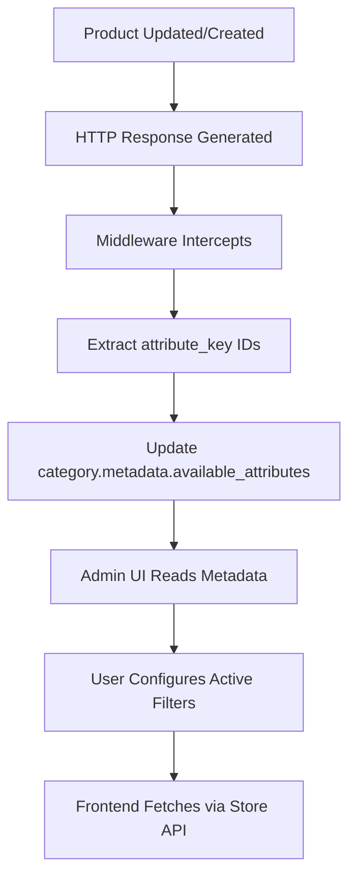

---
**Purpose:** Complete system guide for the Category Filters feature — covers data model, admin configuration UI, store API endpoint, frontend integration, mass sync (nuclear sync), soft-delete filtering, and attribute deletion cascade.

**Solves:** Product categories needed dynamic, configurable filter sidebars (by wattage, color, IP rating, etc.) that are inheritable from parent categories and reconfigurable per category. Medusa v2 has no native filter system for categories.

**Expected Result:** Each category has a `filter_config` in its metadata with `available_filters` (curated via nuclear sync) and `active_filters` (user-configured). The store API serves filter options, and the frontend renders the filter sidebar dynamically.

---

# Category Filters - Complete System Guide

> **Last Updated**: 2026-01-30  
> **Status**: ✅ Production Ready (v2.0 - Soft-Delete Filtering)

> [!WARNING]
> **CRITICAL:** Filter generation MUST exclude soft-deleted attribute links. All queries to `product_product_productattributes_attribute_value` must include `.whereNull("deleted_at")` to prevent ghost values.

## Table of Contents
- [Overview](#overview)
- [System Architecture](#system-architecture)
- [Soft-Delete Filtering](#soft-delete-filtering)
- [Data Model](#data-model)
- [Admin Configuration](#admin-configuration)
- [Store API](#store-api)
- [Frontend Integration](#frontend-integration)
- [Mass Filter Sync](#mass-filter-sync)
- [Attribute Deletion Cascade](#attribute-deletion-cascade)
- [Testing & Debugging](#testing--debugging)

---

## Overview

The Category Filters system allows you to configure which product attributes appear as filters on category pages in your frontend. It consists of:

1. **Admin UI** (`/app/filters`) - Configure filters per category with drag-and-drop ordering
2. **Store API** (`/store/categories/:id/filters`) - Public endpoint for frontend to fetch filter configuration
3. **Filter Generator** - Auto-generates filter metadata based on actual product attributes
4. **Cascade Deletion** - Automatic cleanup when attributes are deleted

### Key Features
- ✅ **Inheritance System** - Child categories can inherit parent filters
- ✅ **Drag-and-Drop Ordering** - Control display order of filters
- ✅ **Nuclear Sync** - Mass populate `available_filters` from product data
- ✅ **Soft-Delete Filtering** - Excludes ghost/deleted attribute links
- ✅ **Complete Cascade Deletion** - Removing an attribute cleans up all references
- ✅ **Metadata Preservation** - `available_filters` survive save operations

> [!IMPORTANT]
> **Critical Bug Fixed (2026-01-31):** Filter save endpoint now correctly preserves `available_filters` metadata. Previously, a JavaScript spread conflict would erase `available_filters` on save, requiring re-running nuclear sync. This is now fixed via explicit destructuring exclusion.

---

## System Architecture

### Data Flow



### Components

| Component | Location | Purpose |
|-----------|----------|---------|
| **Admin UI** | `/src/admin/routes/filters/page.tsx` | Configure which attributes show as filters |
| **Store API** | `/src/api/store/categories/[id]/filters/route.ts` | Public endpoint for frontend |
| **Middleware** | `/src/api/middlewares.ts` | Auto-sync available attributes |
| **Cascade DELETE** | `/src/api/admin/attributes/[id]/route.ts` | Clean up on attribute deletion |

---

## Data Model

### Category Metadata Structure

```typescript
category.metadata = {
  // ⭐ NEW (v2.1): Curated list of attributes found in this category's products
  // Populated by nuclear sync, preserved on save to prevent showing all system attributes
  filter_config?: {
    available_filters?: Array<{
      attribute_id: string,      // ID of the AttributeKey
      order: number,             // Display order in "Available" section
      type: string               // Filter UI type (e.g., 'checkbox')
    }>,
    
    // User-configured active filters (shown in storefront)
    active_filters: Array<{
      attribute_id: string,      // ID of the AttributeKey
      order: number,             // Display order (0-indexed)
      type: string               // Filter UI type (e.g., 'checkbox')
    }>,
    
    override_inheritance: boolean  // false = inherit from parent
  },
  
  // ⚠️ DEPRECATED: Auto-maintained by middleware (being phased out in favor of available_filters)
  available_attributes?: string[]  // ["attr_key_123", "attr_key_456"]
}
```

### Nuclear Sync Workflow

The recommend workflow for managing filters:

1. **Run Nuclear Sync** - Populates `available_filters` for all categories by scanning product attributes
   ```bash
   npx tsx nuclear-filter-sync.ts
   ```

2. **Configure Active Filters** - Use Admin UI (`/app/filters`) to activate desired filters from the available list

3. **Save Configuration** - Metadata preservation ensures `available_filters` survive saves

> [!TIP]
> Nuclear sync should be run once after product import or when adding new categories. The `available_filters` list is then preserved automatically.

### Backward Compatibility

**Old Format (Deprecated):**
```typescript
active_filters: string[]  // ["attr_id_1", "attr_id_2"]
```

**New Format (Current):**
```typescript
active_filters: [{
  attribute_id: "attr_id_1",
  order: 0,
  type: "checkbox"
}]
```

The Store API handles both formats automatically.

---

## Admin Configuration

### Step 1: Navigate to Filters Page

1. Go to **Products → Filters** in Medusa Admin
2. You'll see a 2-column layout:
   - **Left**: Category tree
   - **Right**: Filter configuration panel

### Step 2: Select Category

Click on any category in the tree to configure its filters.

### Step 3: Configure Filters

**Available Filters:**
- Shows only attributes that exist in products within this category
- Auto-updated by middleware when products change

**Active Filters:**
- Drag and drop to reorder
- Click checkboxes to enable/disable
- Order here determines display order in frontend

### Step 4: Inheritance

**Override Inheritance Toggle:**
- **OFF** (default): Inherits parent category's filters
- **ON**: Uses its own filter configuration

**Example Hierarchy:**
```
Electronics (override: ON, filters: [Power, Voltage])
├── LED Strips (override: OFF) → INHERITS [Power, Voltage]
└── Power Supplies (override: ON, filters: [Wattage, IP])
```

### Step 5: Save

Click **"Save Configuration"** to persist changes to `category.metadata.filter_config`.

---

## Store API

### Endpoint

```http
GET /store/categories/:id/filters
```

**Authentication**: Not required (public endpoint)

### Response

```json
{
  "category_id": "pcat_01234",
  "category_name": "Electronics",
  "category_handle": "electronics",
  "filters": [
    {
      "id": "attr_key_power",
      "label": "Power",
      "handle": "power",
      "type": "checkbox",
      "order": 0,
      "display_name": "Wattage",
      "description": "Power consumption in watts",
      "icon": "bolt",
      "unit": "W",
      "filter_order": 0,
      "values": [
        {
          "id": "attr_val_85w",
          "value": "85W"
        },
        {
          "id": "attr_val_100w",
          "value": "100W"
        }
      ]
    }
  ],
  "inherited": false
}
```

### Response Fields

| Field | Type | Description |
|-------|------|-------------|
| `category_id` | string | Category ID |
| `category_name` | string | Category display name |
| `category_handle` | string | URL-friendly handle |
| `filters` | FilterItem[] | Array of filter configurations |
| `inherited` | boolean | True if using parent's filters |

### FilterItem Fields

| Field | Type | Description |
|-------|------|-------------|
| `id` | string | attribute_key.id |
| `label` | string | attribute_key.label |
| `handle` | string | attribute_key.handle |
| `type` | string | Filter UI type (checkbox, etc.) |
| `order` | number | Display order |
| `display_name` | string? | Override display text (NEW) |
| `description` | string? | Help text (NEW) |
| `icon` | string? | Icon identifier (NEW) |
| `unit` | string? | Measurement unit (NEW) |
| `filter_order` | number? | Sort order override (NEW) |
| `values` | AttributeValue[] | Available values |

---

## Frontend Integration

### React/Next.js Example

```typescript
import { useEffect, useState } from 'react'

interface FilterValue {
  id: string
  value: string
}

interface Filter {
  id: string
  label: string
  handle: string
  display_name?: string
  description?: string
  icon?: string
  unit?: string
  values: FilterValue[]
}

export function useCategoryFilters(categoryId: string) {
  const [filters, setFilters] = useState<Filter[]>([])
  const [loading, setLoading] = useState(true)

  useEffect(() => {
    fetch(`/store/categories/${categoryId}/filters`)
      .then(res => res.json())
      .then(data => {
        setFilters(data.filters || [])
        setLoading(false)
      })
  }, [categoryId])

  return { filters, loading }
}

// Usage
export function CategoryFilters({ categoryId }: { categoryId: string }) {
  const { filters, loading } = useCategoryFilters(categoryId)

  if (loading) return <div>Loading filters...</div>
  if (filters.length === 0) return null

  return (
    <div className="filters">
      {filters.map(filter => (
        <div key={filter.id} className="filter-group">
          <h3>
            {filter.icon && <span>{filter.icon}</span>}
            {filter.display_name || filter.label}
            {filter.unit && <span className="unit">({filter.unit})</span>}
          </h3>
          {filter.description && <p>{filter.description}</p>}
          
          <div className="filter-values">
            {filter.values.map(value => (
              <label key={value.id}>
                <input type="checkbox" value={value.id} />
                {value.value}
              </label>
            ))}
          </div>
        </div>
      ))}
    </div>
  )
}
```

### Astro Example

```astro
---
const categoryId = Astro.params.id
const response = await fetch(
  `http://localhost:9000/store/categories/${categoryId}/filters`
)
const data = await response.json()
const filters = data.filters || []
---

<div class="category-filters">
  {filters.map(filter => (
    <div class="filter-group">
      <h3>
        {filter.icon && <span>{filter.icon}</span>}
        {filter.display_name || filter.label}
      </h3>
      {filter.description && <p>{filter.description}</p>}
      
      <div class="filter-values">
        {filter.values.map(value => (
          <label>
            <input type="checkbox" value={value.id} />
            {value.value}
          </label>
        ))}
      </div>
    </div>
  ))}
</div>
```

---

## Attribute Deletion Cascade

When an attribute is deleted via `DELETE /admin/attributes/:id`, the system performs complete cascade cleanup:

### Cascade Flow

```
1. Fetch all categories (HTTP GET /admin/product-categories?limit=1000)
   ↓
2. For each category with filter_config:
   - Check if deleted attribute exists in active_filters
   - Remove from old format (string[])
   - Remove from new format (object[]) and recompute orders
   - Update via HTTP POST /admin/product-categories/:id
   ↓
3. Get all AttributeValues for the attribute
   ↓
4. Query product-attribute links from pivot table
   ↓
5. Dismiss all links (remoteLink.dismiss with both modules)
   ↓
6. Delete all AttributeValues
   ↓
7. Delete the AttributeKey itself
```

### HTTP-Based Pattern

**Why HTTP instead of direct service resolution?**

Admin endpoints cannot directly resolve `productCategoryModuleService` (though Store API can). The HTTP pattern ensures reliability:

```typescript
// ✅ Works in admin context
const categoriesResponse = await fetch(
  `${basePath}/admin/product-categories?limit=1000`,
  { headers: { "Cookie": req.headers.cookie } }
)

// ❌ Fails in admin context
const service = req.scope.resolve("productCategoryModuleService")
```

### Performance

**Measured on test attribute with 1 product link:**
- Total time: ~910ms
- Category fetch: ~294ms
- Links + values deletion: ~400ms
- AttributeKey deletion: ~200ms

---

## Testing & Debugging

### Manual Test: Filter Configuration

1. **Go to** `/app/filters`
2. **Select** a category from tree
3. **Toggle** some attribute checkboxes
4. **Drag** to reorder filters
5. **Toggle** "Override Inheritance"
6. **Click** "Save"
7. **Reload** page → Configuration persists

### Test Inheritance

**Parent Category:**
```json
{
  "filter_config": {
    "override_inheritance": true,
    "active_filters": [
      {"attribute_id": "power", "order": 0, "type": "checkbox"}
    ]
  }
}
```

**Child Category (override: false):**
```bash
curl http://localhost:9000/store/categories/CHILD_ID/filters
```

**Expected:**
```json
{
  "filters": [...],  // Parent's filters
  "inherited": true
}
```

### Test Attribute Deletion

```bash
# 1. Note which categories use this attribute
# 2. Delete the attribute via admin UI
# 3. Check logs for cascade:
GET /admin/product-categories?limit=1000 (200) - ~300ms
DELETE /admin/attributes/ATTR_ID (200) - ~900ms

# 4. Verify category metadata cleaned:
# Go to /app/filters, select category
# Deleted attribute should not appear in active_filters
```

### Debug Middleware

```bash
# Product updated
🔄 [CATEGORY-ATTRS] Scheduled update for 2 categories

# After 2s debounce
✅ [CATEGORY-ATTRS] Updated category pcat_123 with 5 available attributes
```

### Check Category Metadata (SQL)

```sql
SELECT 
  id, 
  name, 
  metadata->'available_attributes' as available_attrs,
  metadata->'filter_config' as filter_config
FROM product_category 
WHERE id = 'pcat_YOUR_ID';
```

### Common Issues

| Issue | Cause | Solution |
|-------|-------|----------|
| Attributes not showing in UI | `available_attributes` not populated | Update any product in category, wait 2s |
| Middleware not firing | Matcher pattern incorrect | Check `matcher: "/admin/products*"` |
| Empty available_attributes | Products missing `metadata.attributes` | Ensure products have attribute metadata |
| DELETE returns 500 | Service resolution failed | Verify HTTP-based pattern is used |

---

## Performance Benchmarks

**Test Setup:**
- 200 products per category
- 50 attributes per product
- Simultaneous updates

**Results:**
- Middleware overhead: 5-10ms
- HTTP response time: Unaffected (async)
- Category update: 100-200ms (debounced)
- UI load time: <100ms

**Scalability:**
- ✅ <500 products/category: Instant
- ✅ 500-2000 products/category: Fast (<1s)
- ⚠️ 2000+ products/category: Consider caching

---

## Technical References

### Files Modified (This Feature)

**Backend:**
- `src/api/admin/attributes/[id]/route.ts` - DELETE cascade
- `src/api/store/categories/[id]/filters/route.ts` - Store API
- `src/api/middlewares.ts` - Auto-sync middleware
- `src/lib/category-attributes-sync.ts` - Sync helpers

**Frontend:**
- `src/admin/routes/filters/page.tsx` - Filters admin UI
- `src/admin/hooks/useCategoryConfig.ts` - Category config state
- `src/admin/hooks/useFiltersData.ts` - Data fetching

**Database:**
- `src/modules/product-attributes/models/attribute-key.ts` - Added display metadata
- `src/migrations/Migration20260129192804.ts` - Metadata fields migration

### Related Documentation

- [Product Attributes Architecture](file:///home/alejo/medusa-starter-default/docs/product-attributes-architecture.md)
- [Middleware Pattern Reference](file:///home/alejo/medusa-starter-default/docs/MEDUSA_V2_SUBSCRIBER_BUG_AND_MIDDLEWARE_FIX.md)
- [Frontend Integration Guide](file:///home/alejo/medusa-starter-default/docs/FRONTEND_INTEGRATION_GUIDE.md)

---

**Questions or Issues?** Check the [Testing & Debugging](#testing--debugging) section above.
