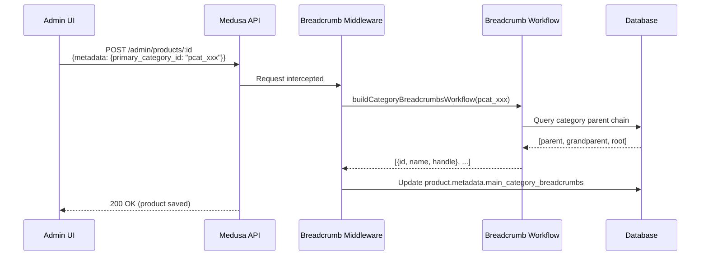
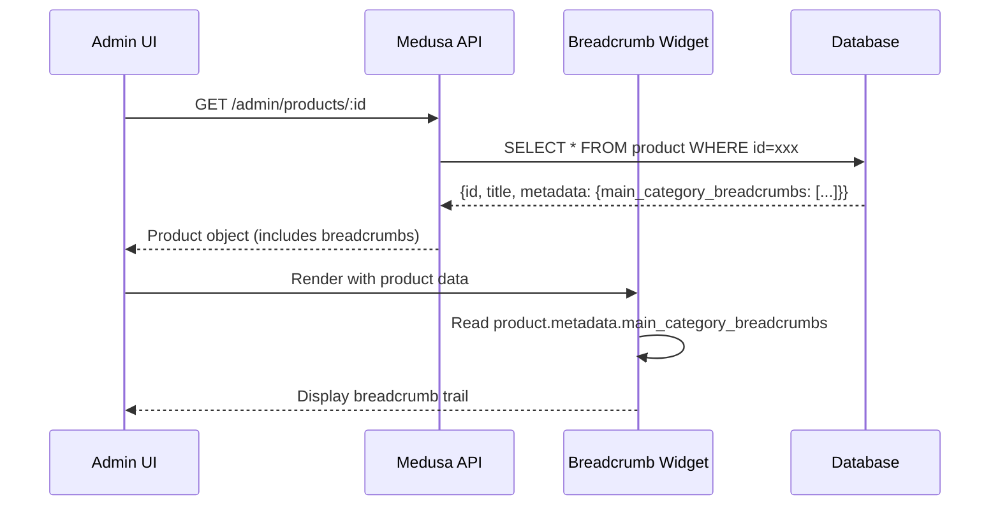

# Frontend Implementation: Product Category Breadcrumbs

## 📋 Overview

This document explains how to access and display category breadcrumbs in the Medusa v2 Admin frontend. Breadcrumbs are **pre-calculated** and stored in product metadata, requiring **zero additional API calls**.

---

## 🗂️ Data Structure

### Where Breadcrumbs are Stored

```typescript
// Location: product.metadata.main_category_breadcrumbs
{
  "product": {
    "id": "prod_xxx",
    "title": "Product Name",
    "metadata": {
      "primary_category_id": "pcat_waterproof-power-supplies",
      "main_category_breadcrumbs": [
        {
          "id": "pcat_by-categories",
          "name": "BY CATEGORIES",
          "handle": "by-categories"
        },
        {
          "id": "pcat_led-drivers",
          "name": "LED Drivers",
          "handle": "led-drivers"
        },
        {
          "id": "pcat_waterproof-power-supplies",
          "name": "WATERPROOF",
          "handle": "waterproof-power-supplies"
        }
      ]
    }
  }
}
```

### TypeScript Type Definition

```typescript
type BreadcrumbItem = {
  id: string        // Category ID (e.g., "pcat_waterproof-power-supplies")
  name: string      // Display name (e.g., "WATERPROOF")
  handle: string    // URL-friendly slug (e.g., "waterproof-power-supplies")
}

type ProductMetadata = {
  primary_category_id?: string
  main_category_breadcrumbs?: BreadcrumbItem[]
  // ... other metadata fields
}
```

---

## 🎯 How to Access Breadcrumbs in Frontend

### Step 1: Product Data is Already Available

The product object passed to your widget/component **already contains** the metadata:

```tsx
// In any Medusa Admin widget or component
const ProductComponent = ({ data: product }) => {
  // ✅ Breadcrumbs are HERE - no need to fetch!
  const breadcrumbs = product.metadata?.main_category_breadcrumbs || []
  
  console.log(breadcrumbs)
  // Output: [{ id: "pcat_xxx", name: "Category", handle: "category" }, ...]
}
```

### Step 2: No API Calls Required

**IMPORTANT:** You do NOT need to:
- ❌ Call any API endpoint
- ❌ Use `useQuery` or `useFetch`
- ❌ Import category services
- ❌ Make database queries

The breadcrumbs are **pre-calculated by the backend middleware** and already included in the product data.

---

## 🎨 Complete Widget Implementation

### File: `src/admin/widgets/product-breadcrumb-display-widget.tsx`

```tsx
import { defineWidgetConfig } from "@medusajs/admin-sdk"
import { Container, Heading } from "@medusajs/ui"
import { DetailWidgetProps, AdminProduct } from "@medusajs/framework/types"
import { Link } from "react-router-dom"

// Type definition for breadcrumb items
type BreadcrumbItem = {
  id: string
  name: string
  handle: string
}

/**
 * Product Breadcrumb Display Widget
 * 
 * Displays the category hierarchy for a product as clickable breadcrumbs.
 * Data source: product.metadata.main_category_breadcrumbs (pre-calculated)
 * 
 * @param props.data - The product object from Medusa Admin
 */
const ProductBreadcrumbWidget = ({
  data: product,
}: DetailWidgetProps<AdminProduct>) => {
  // STEP 1: Extract breadcrumbs from metadata
  const breadcrumbs = (product.metadata?.main_category_breadcrumbs as BreadcrumbItem[]) || []

  // STEP 2: Return null if no breadcrumbs (product has no primary category)
  if (breadcrumbs.length === 0) {
    return null
  }

  // STEP 3: Render breadcrumb trail
  return (
    <Container className="divide-y p-0">
      <div className="flex items-center justify-between px-6 py-4">
        <Heading level="h2">Category Path</Heading>
      </div>

      <div className="px-6 py-4">
        <nav aria-label="Product Category Breadcrumb">
          <ol className="flex items-center gap-2 text-sm">
            {/* Render each breadcrumb as a clickable link */}
            {breadcrumbs.map((crumb, index) => (
              <li key={crumb.id} className="flex items-center gap-2">
                {/* Link to category page */}
                <Link
                  to={`/categories/${crumb.id}`}
                  className="text-blue-600 hover:text-blue-800 hover:underline transition-colors"
                >
                  {crumb.name}
                </Link>
                
                {/* Separator (show if not last item) */}
                {index < breadcrumbs.length - 1 && (
                  <span className="text-gray-400">/</span>
                )}
              </li>
            ))}
            
            {/* Final breadcrumb: Product Title (not a link) */}
            <li className="flex items-center gap-2">
              <span className="text-gray-400">/</span>
              <span className="text-gray-700 font-medium">
                {product.title}
              </span>
            </li>
          </ol>
        </nav>
      </div>
    </Container>
  )
}

// Widget configuration
export const config = defineWidgetConfig({
  zone: "product.details.before", // Display at top of product detail page
})

export default ProductBreadcrumbWidget
```

---

## 🔧 Widget Configuration Explained

### Widget Placement Zones

```typescript
export const config = defineWidgetConfig({
  zone: "product.details.before",  // ← Key configuration
})
```

**Available zones for product pages:**
- `"product.details.before"` - **Top of page** (recommended for breadcrumbs)
- `"product.details.after"` - Bottom of page
- `"product.details.side.before"` - Top of sidebar
- `"product.details.side.after"` - Bottom of sidebar

**Why `before`?**  
Breadcrumbs are navigation aids and should be visible immediately when the page loads.

---

## 🚀 How the Data Flows (Complete Process)

### 1. **User Updates Product Category**



### 2. **User Views Product Details**



**Key Point:** No separate API call for breadcrumbs! They're already in the product object.

---

## 📊 Data Flow Summary for Frontend Developer

### What You Get Automatically

```typescript
// When your widget/component receives the product object:
const ProductWidget = ({ data: product }) => {
  // ✅ This is ALREADY available:
  const breadcrumbs = product.metadata?.main_category_breadcrumbs
  
  // Type: BreadcrumbItem[] | undefined
  // Structure: [
  //   { id: "pcat_root", name: "Root Category", handle: "root-category" },
  //   { id: "pcat_parent", name: "Parent", handle: "parent" },
  //   { id: "pcat_current", name: "Current", handle: "current" }
  // ]
}
```

### What You Need to Do

```typescript
// 1. Extract breadcrumbs from metadata
const breadcrumbs = product.metadata?.main_category_breadcrumbs || []

// 2. Check if breadcrumbs exist
if (breadcrumbs.length === 0) return null

// 3. Map over array and render
breadcrumbs.map(crumb => (
  <Link to={`/categories/${crumb.id}`}>
    {crumb.name}
  </Link>
))
```

### What You DON'T Need to Do

```typescript
// ❌ DON'T fetch categories separately
const { data: categories } = useQuery(...)  // NOT NEEDED

// ❌ DON'T call category service
const categoryService = useCategoryService()  // NOT NEEDED

// ❌ DON'T make additional API calls
fetch('/admin/categories')  // NOT NEEDED
```

---

## 🛠️ Frontend Developer Checklist

### To Implement Breadcrumbs Display

- [ ] **Step 1:** Create widget file: `src/admin/widgets/product-breadcrumb-display-widget.tsx`
- [ ] **Step 2:** Copy the complete widget code (see above)
- [ ] **Step 3:** Verify `zone: "product.details.before"` in config
- [ ] **Step 4:** Save file (Medusa auto-detects widgets)
- [ ] **Step 5:** Restart dev server: `yarn dev`
- [ ] **Step 6:** Test by viewing any product in Admin

### To Verify It Works

1. Navigate to any product in Admin UI
2. Widget should appear at top of page
3. Click breadcrumb links → Should navigate to category pages
4. If no breadcrumbs show:
   - Check: Does product have `metadata.primary_category_id`?
   - Check: Does `metadata.main_category_breadcrumbs` exist?
   - Run backfill script if needed

---

## 🧪 Testing & Debugging

### How to Check if Breadcrumbs Exist

```typescript
// Option 1: In Widget
console.log('Product metadata:', product.metadata)
console.log('Breadcrumbs:', product.metadata?.main_category_breadcrumbs)

// Option 2: Browser DevTools
// 1. Open product page
// 2. Open Console
// 3. View network request for product
// 4. Check response → metadata → main_category_breadcrumbs
```

### Common Issues

| Issue | Cause | Solution |
|-------|-------|----------|
| Widget doesn't appear | Product has no `primary_category_id` | Set primary category in Admin |
| Empty breadcrumbs array | Middleware hasn't processed yet | Save product again to trigger |
| Widget shows but empty | Metadata missing from response | Check API response includes metadata |
| Links don't work | Wrong category ID format | Verify `crumb.id` starts with `pcat_` |

---

## 🎨 Customization Examples

### Example 1: Different Styling

```tsx
// Use Medusa UI Badge component
import { Badge } from "@medusajs/ui"

breadcrumbs.map(crumb => (
  <Badge key={crumb.id}>
    <Link to={`/categories/${crumb.id}`}>
      {crumb.name}
    </Link>
  </Badge>
))
```

### Example 2: Separator Icons

```tsx
import { ChevronRight } from "@medusajs/icons"

breadcrumbs.map((crumb, index) => (
  <li key={crumb.id} className="flex items-center gap-1">
    <Link to={`/categories/${crumb.id}`}>{crumb.name}</Link>
    {index < breadcrumbs.length - 1 && <ChevronRight />}
  </li>
))
```

### Example 3: Compact View

```tsx
// Show only last 2 levels
const compactBreadcrumbs = breadcrumbs.slice(-2)

compactBreadcrumbs.map(crumb => (
  <span>{crumb.name}</span>
))
```

---

## 🔒 Data Guarantees

### What Backend Guarantees

✅ **Always includes:**
- Category `id` (always starts with `pcat_`)
- Category `name` (display name)
- Category `handle` (URL slug)

✅ **Array order:**
- Index 0 = Root category (topmost)
- Index n = Current category (deepest)
- Always ordered from root → leaf

✅ **Data consistency:**
- Breadcrumbs updated automatically when `primary_category_id` changes
- No stale data (middleware updates on every save)

### What Frontend Should Handle

⚠️ **Edge cases:**
- Product with no categories → `breadcrumbs = []`
- Product with category but no breadcrumbs → Missing `main_category_breadcrumbs` key
- Circular category references → Backend prevents (max 10 levels)

---

## 📝 Complete Checklist for Frontend Agent

### Information Required

1. **Data Source:**
   - ✅ `product.metadata.main_category_breadcrumbs`
   - ✅ Type: `Array<{id: string, name: string, handle: string}>`

2. **Access Method:**
   - ✅ Direct property access (no API call)
   - ✅ Data is pre-calculated by backend

3. **Rendering:**
   - ✅ Map over array
   - ✅ Render as `<Link to={/categories/${id}}>`
   - ✅ Add separators between items
   - ✅ Show product title as final item

4. **Widget Config:**
   - ✅ Zone: `"product.details.before"`
   - ✅ File: `src/admin/widgets/product-breadcrumb-display-widget.tsx`

### Implementation Steps

1. Create widget file
2. Import required components (`Container`, `Heading`, `Link`)
3. Define `BreadcrumbItem` type
4. Extract `breadcrumbs` from `product.metadata`
5. Return `null` if empty
6. Map and render breadcrumb links
7. Export widget with config
8. Restart server to load widget

---

## 🚀 Quick Start Template

```tsx
// COPY-PASTE READY TEMPLATE
import { defineWidgetConfig } from "@medusajs/admin-sdk"
import { Container, Heading } from "@medusajs/ui"
import { DetailWidgetProps, AdminProduct } from "@medusajs/framework/types"
import { Link } from "react-router-dom"

type BreadcrumbItem = { id: string; name: string; handle: string }

const ProductBreadcrumbWidget = ({ data: product }: DetailWidgetProps<AdminProduct>) => {
  const breadcrumbs = (product.metadata?.main_category_breadcrumbs as BreadcrumbItem[]) || []
  if (breadcrumbs.length === 0) return null

  return (
    <Container className="divide-y p-0">
      <div className="flex items-center justify-between px-6 py-4">
        <Heading level="h2">Category Path</Heading>
      </div>
      <div className="px-6 py-4">
        <nav aria-label="Product Category Breadcrumb">
          <ol className="flex items-center gap-2 text-sm">
            {breadcrumbs.map((crumb, index) => (
              <li key={crumb.id} className="flex items-center gap-2">
                <Link to={`/categories/${crumb.id}`} className="text-blue-600 hover:underline">
                  {crumb.name}
                </Link>
                {index < breadcrumbs.length - 1 && <span className="text-gray-400">/</span>}
              </li>
            ))}
            <li className="flex items-center gap-2">
              <span className="text-gray-400">/</span>
              <span className="text-gray-700 font-medium">{product.title}</span>
            </li>
          </ol>
        </nav>
      </div>
    </Container>
  )
}

export const config = defineWidgetConfig({ zone: "product.details.before" })
export default ProductBreadcrumbWidget
```

---

## 📚 Additional Resources

- **Medusa Admin SDK:** https://docs.medusajs.com/references/admin-sdk
- **Widget Zones:** https://docs.medusajs.com/admin-development/widgets
- **Type Definitions:** `@medusajs/framework/types`

---

## ✅ Success Criteria

Your implementation is correct when:

1. ✅ Widget appears at top of product detail page
2. ✅ Breadcrumbs display category hierarchy (root → leaf)
3. ✅ Links navigate to correct category pages
4. ✅ Product title appears as final breadcrumb (not clickable)
5. ✅ Widget hides for products without categories
6. ✅ No console errors
7. ✅ No additional API calls for breadcrumbs

---

**Last Updated:** 2026-01-28  
**Version:** 1.0  
**Status:** ✅ Production Ready
