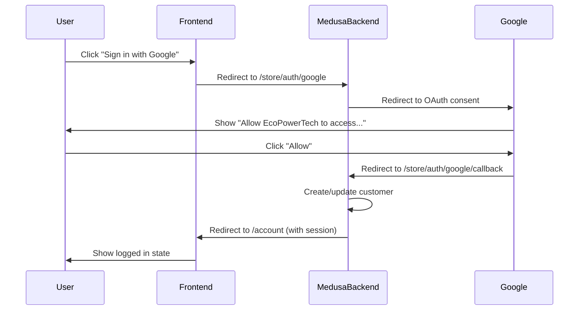

# Google OAuth Implementation - Complete Guide

## ✅ Status: Backend Configured

Your backend is **fully configured** for Google OAuth! The error you're seeing is expected when accessing OAuth endpoints directly.

---

## How OAuth Actually Works



---

## Testing OAuth (Now that Backend is Ready)

### ❌ What DOESN'T Work

```bash
# Direct browser access will fail:
http://localhost:9000/store/auth/google

# Error: "Publishable API key required"
# This is EXPECTED - OAuth needs to be initiated from frontend
```

### ✅ What DOES Work

**Option 1: Quick Test with HTML File**

Create this file anywhere on your computer:

```html
<!-- test-google-oauth.html -->
<!DOCTYPE html>
<html>
<head>
    <title>Test Google OAuth</title>
</head>
<body>
    <h1>Google OAuth Test</h1>
    
    <button onclick="loginWithGoogle()" style="
        padding: 12px 24px;
        font-size: 16px;
        background: #4285f4;
        color: white;
        border: none;
        border-radius: 4px;
        cursor: pointer;
    ">
        🔐 Sign in with Google
    </button>
    
    <script>
        function loginWithGoogle() {
            // Redirect to Medusa backend OAuth endpoint
            window.location.href = 'http://localhost:9000/store/auth/google';
        }
    </script>
</body>
</html>
```

**Steps:**
1. Save as `test-google-oauth.html`
2. Open in browser (double-click)
3. Click "Sign in with Google"
4. Should redirect to Google consent screen
5. Click "Allow"
6. Should redirect back and create customer

---

## Frontend Integration (Your Storefront)

Now that backend is ready, add this to your storefront (`ecopowertech-headless-medusa`):

### 1. Login Button Component

```tsx
// src/components/GoogleLoginButton.tsx
'use client'

export function GoogleLoginButton() {
    const handleGoogleLogin = () => {
        // Redirect to Medusa OAuth endpoint
        window.location.href = `${process.env.NEXT_PUBLIC_MEDUSA_BACKEND_URL}/store/auth/google`
    }
    
    return (
        <button
            onClick={handleGoogleLogin}
            className="flex items-center gap-3 px-6 py-3 border border-gray-300 rounded-lg hover:bg-gray-50 transition"
        >
            <svg className="w-5 h-5" viewBox="0 0 24 24">
                <path fill="#4285F4" d="M22.56 12.25c0-.78-.07-1.53-.2-2.25H12v4.26h5.92c-.26 1.37-1.04 2.53-2.21 3.31v2.77h3.57c2.08-1.92 3.28-4.74 3.28-8.09z"/>
                <path fill="#34A853" d="M12 23c2.97 0 5.46-.98 7.28-2.66l-3.57-2.77c-.98.66-2.23 1.06-3.71 1.06-2.86 0-5.29-1.93-6.16-4.53H2.18v2.84C3.99 20.53 7.7 23 12 23z"/>
                <path fill="#FBBC05" d="M5.84 14.09c-.22-.66-.35-1.36-.35-2.09s.13-1.43.35-2.09V7.07H2.18C1.43 8.55 1 10.22 1 12s.43 3.45 1.18 4.93l2.85-2.22.81-.62z"/>
                <path fill="#EA4335" d="M12 5.38c1.62 0 3.06.56 4.21 1.64l3.15-3.15C17.45 2.09 14.97 1 12 1 7.7 1 3.99 3.47 2.18 7.07l3.66 2.84c.87-2.6 3.3-4.53 6.16-4.53z"/>
            </svg>
            <span>Continue with Google</span>
        </button>
    )
}
```

### 2. Add to Login Page

```tsx
// src/app/login/page.tsx
import { GoogleLoginButton } from '@/components/GoogleLoginButton'

export default function LoginPage() {
    return (
        <div className="max-w-md mx-auto p-6">
            <h1 className="text-2xl font-bold mb-6">Login</h1>
            
            {/* Email/Password Form */}
            <form className="space-y-4 mb-6">
                <input type="email" placeholder="Email" className="w-full px-4 py-2" />
                <input type="password" placeholder="Password" className="w-full px-4 py-2" />
                <button type="submit" className="w-full bg-black text-white py-2">
                    Sign In
                </button>
            </form>
            
            {/* Divider */}
            <div className="relative my-6">
                <div className="absolute inset-0 flex items-center">
                    <div className="w-full border-t border-gray-300" />
                </div>
                <div className="relative flex justify-center text-sm">
                    <span className="px-2 bg-white text-gray-500">OR</span>
                </div>
            </div>
            
            {/* Google OAuth */}
            <GoogleLoginButton />
        </div>
    )
}
```

---

## Google Cloud Console Setup

### Add Authorized Redirect URIs

Go to: [Google Cloud Console → APIs & Services → Credentials](https://console.cloud.google.com/apis/credentials)

**Add these URIs to your OAuth Client:**

```
# Local Development
http://localhost:9000/store/auth/google/callback

# Production (when deployed)
https://your-backend.railway.app/store/auth/google/callback
```

---

## Current Configuration Summary

### Backend (.env)
```env
✅ GOOGLE_CLIENT_ID=YOUR_GOOGLE_CLIENT_ID.apps.googleusercontent.com
✅ GOOGLE_CLIENT_SECRET=GOCSPX-YOUR_SECRET_HERE
✅ STOREFRONT_URL=http://localhost:3000
✅ MEDUSA_BACKEND_URL=http://localhost:9000
```


### Backend (medusa-config.ts)
```typescript
✅ Plugin: medusa-plugin-auth
✅ Provider: google
✅ Callback URL: http://localhost:9000/store/auth/google/callback
✅ Success Redirect: http://localhost:3000/account
✅ Failure Redirect: http://localhost:3000/login
```

---

## Troubleshooting

### Error: "Publishable API key required"

**Cause:** You're accessing `/store/auth/google` directly from browser/curl.

**Solution:** OAuth must be initiated from frontend with a button click. Use the HTML test file above.

---

### Error: "Redirect URI mismatch"

**Cause:** Google Console redirect URIs don't match your callback URL.

**Solution:** 
1. Go to Google Cloud Console
2. Add exact callback URL: `http://localhost:9000/store/auth/google/callback`
3. Wait 5 minutes for Google to propagate changes

---

**Ready to test? Use the HTML test file above or integrate into your storefront!** 🚀
