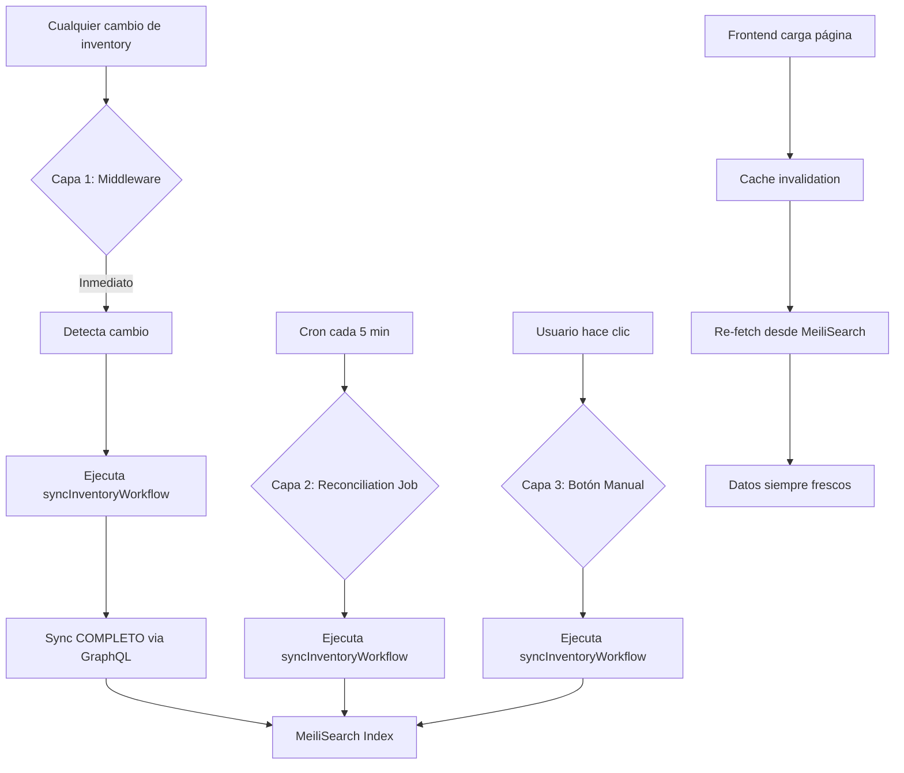
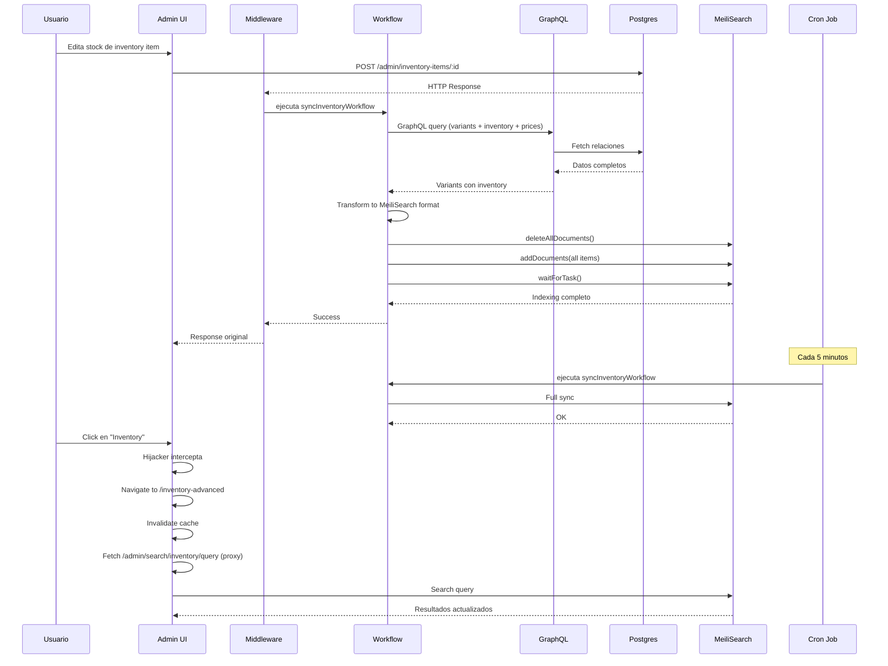

# Inventory Advanced - Complete Auto-Sync Architecture

## Resumen Ejecutivo

Este documento detalla la arquitectura completa del sistema de búsqueda avanzada de inventory con **sincronización automática en 3 capas**, reemplazando completamente la página nativa de Inventory en Medusa v2.

### Logros Principales

✅ **Búsqueda avanzada** con MeiliSearch en `/app/inventory-advanced`  
✅ **Hijacking del sidebar** - Redirección transparente desde botón nativo  
✅ **Auto-sync en 3 capas** - Middleware + Reconciliation Job + Manual  
✅ **Workflow-based sync** - Sincronización completa vía GraphQL query  
✅ **Relaciones complejas** - Variants + Inventory Items + Prices  
✅ **Cache invalidation automática** - Datos frescos al cargar página  
✅ **Navegación SPA** - Sin recargas de página  

---

## Tabla de Contenidos

1. [Arquitectura de Auto-Sync](#arquitectura-de-auto-sync)
2. [Complejidad de Inventory en Medusa v2](#complejidad-de-inventory-en-medusa-v2)
3. [Estructura de Archivos](#estructura-de-archivos)
4. [Workflow de Sync](#workflow-de-sync)
5. [Capa 1: Middleware con Workflow](#capa-1-middleware-con-workflow)
6. [Capa 2: Reconciliation Job](#capa-2-reconciliation-job)
7. [Capa 3: Sync Manual](#capa-3-sync-manual)
8. [Cache Invalidation Frontend](#cache-invalidation-frontend)
9. [Hijacking del Sidebar](#hijacking-del-sidebar)
10. [Flujo Completo de Datos](#flujo-completo-de-datos)
11. [Troubleshooting](#troubleshooting)

---

## Arquitectura de Auto-Sync

### Problema Especial de Inventory

Inventory es **más complejo** que Products/Customers porque:

1. **Múltiples módulos** - `product`, `inventory`, `pricing`
2. **Relaciones complejas** - Variant → InventoryItem → InventoryLevel
3. **Múltiples endpoints** que afectan inventory:
   - `/admin/inventory-items/:id` (stock)
   - `/admin/products/:id/variants/:vid` (SKU/prices)
   - `/admin/stock-locations/:id/items` (locations)

### Solución: Workflow-Based Sync

En lugar de sync granular (producto por producto), inventory usa **sync completo vía workflow** cada vez que cambia algo.



---

## Complejidad de Inventory en Medusa v2

### Estructura de Datos

```typescript
// Un inventory item en MeiliSearch combina datos de:

// 1. ProductVariant (SKU, producto info)
variant: {
    id: "variant_123",
    sku: "ECB-18-2-STR-WH",
    product: {
        id: "prod_123",
        title: "18/2 AWG Wire",
        thumbnail: "url",
        categories: [...],
    }
}

// 2. InventoryItem (stock físico)
inventory_item: {
    id: "iitem_123",
    sku: "ECB-18-2-STR-WH",  // Puede diferir de variant.sku
    title: "18/2 AWG Wire",  // Descripción alterna
    stocked_quantity: 500,
    reserved_quantity: 25,
}

// 3. Price (via PriceSet)
price: {
    amount: 1250,  // $12.50 en centavos
    currency_code: "USD"
}

// Resultado en MeiliSearch:
{
    id: "iitem_123",
    sku: "ECB-18-2-STR-WH",
    title: "18/2 AWG Wire",
    totalStock: 500,
    totalReserved: 25,
    price: 12.50,
    currencyCode: "USD",
    variantId: "variant_123",
    productId: "prod_123",
    thumbnail: "url",
    category_handles: ["wire", "electrical"],
    status: "published"
}
```

### GraphQL Query del Workflow

```typescript
// src/workflows/sync-inventory.ts
const { data: variants } = await query.graph({
    entity: "product_variant",
    fields: [
        "id",
        "sku",
        "product.id",
        "product.title",
        "product.thumbnail",
        "product.status",
        "product.categories.id",
        "product.categories.handle",
        "product.categories.parent_category.handle",
        "prices.amount",
        "prices.currency_code",
        "inventory_items.inventory.id",
        "inventory_items.inventory.sku",
        "inventory_items.inventory.title",
        "inventory_items.inventory.stocked_quantity",
        "inventory_items.inventory.reserved_quantity",
    ],
})
```

---

## Estructura de Archivos

```
src/
├── admin/
│   ├── routes/
│   │   └── inventory-advanced/
│   │       ├── page.tsx                        # Página principal
│   │       ├── components/
│   │       │   ├── inventory-header.tsx        # Header con filtros
│   │       │   └── inventory-table.tsx         # Tabla de inventory
│   │       └── hooks/
│   │           ├── use-inventory-page-state.tsx  # Estado
│   │           └── use-inventory-search.ts       # Query MeiliSearch
│   ├── widgets/
│   │   └── sidebar-hijacker.tsx                # ⭐ Hijacker global
│   └── lib/
│       ├── meili-client.ts                     # Cliente frontend
│       └── meili-types.ts                      # Types TypeScript
│
├── api/
│   ├── middlewares.ts                          # ⭐ Middleware auto-sync
│   └── admin/
│       └── search/
│           └── inventory/
│               ├── sync/
│               │   └── route.ts                # Endpoint sync manual
│               └── query/
│                   └── route.ts                # Proxy search
│
├── jobs/
│   └── reconcile-inventory.ts                  # ⭐ Job cada 5 min
│
└── workflows/
    └── sync-inventory.ts                       # ⭐ Workflow completo
```

---

## Workflow de Sync

### Archivo: `src/workflows/sync-inventory.ts`

**El corazón del sistema** - Todo el sync pasa por este workflow.

### Implementación Completa

```typescript
import { createWorkflow, WorkflowResponse } from "@medusajs/framework/workflows-sdk"
import { createStep, StepResponse } from "@medusajs/framework/workflows-sdk"

export const syncInventoryToMeiliStep = createStep(
    "sync-to-meili-step",
    async (_, { container }) => {
        const { MeiliSearch } = await import("meilisearch")
        const query = container.resolve("query") as any

        // ⭐ GraphQL query para obtener TODA la info
        const { data: variants } = await query.graph({
            entity: "product_variant",
            fields: [
                "id",
                "sku",
                "product.id",
                "product.title",
                "product.thumbnail",
                "product.status",
                "product.categories.id",
                "product.categories.handle",
                "product.categories.parent_category.handle",
                "product.categories.parent_category.parent_category.handle",
                "prices.amount",
                "prices.currency_code",
                "inventory_items.inventory.id",
                "inventory_items.inventory.sku",
                "inventory_items.inventory.title",
                "inventory_items.inventory.stocked_quantity",
                "inventory_items.inventory.reserved_quantity",
            ],
        })

        // ⭐ Transform: Variant → Inventory Items
        const meiliInventoryItems = variants.flatMap((variant: any) => {
            const product = variant.product
            const priceObj = variant.prices?.[0]

            // Flatten category handles (including parents)
            const allCategoryHandles = new Set<string>()
            product?.categories?.forEach((c: any) => {
                if (c.handle) allCategoryHandles.add(c.handle)
                if (c.parent_category?.handle) 
                    allCategoryHandles.add(c.parent_category.handle)
                if (c.parent_category?.parent_category?.handle) 
                    allCategoryHandles.add(c.parent_category.parent_category.handle)
            })

            // Map cada inventory item vinculado a este variant
            return (variant.inventory_items || []).map((invItem: any) => {
                const inventory = invItem.inventory
                return {
                    id: inventory.id,
                    sku: inventory.sku || variant.sku || "",
                    title: inventory.title || product?.title || "Untitled",
                    thumbnail: product?.thumbnail || null,
                    totalStock: inventory.stocked_quantity || 0,
                    totalReserved: inventory.reserved_quantity || 0,
                    price: priceObj?.amount || 0,  // v2: ya en dólares
                    currencyCode: priceObj?.currency_code?.toUpperCase() || "USD",
                    variantId: variant.id,
                    productId: product?.id || null,
                    category_handles: Array.from(allCategoryHandles),
                    status: product?.status || "draft",
                }
            })
        })

        // Filter orphaned items (sin variantId/productId)
        const validItems = meiliInventoryItems.filter(
            (item: any) => item.variantId && item.productId
        )

        // ⭐ Sync to MeiliSearch
        const client = new MeiliSearch({
            host: process.env.MEILISEARCH_HOST!,
            apiKey: process.env.MEILISEARCH_API_KEY!,
        })
        const index = client.index("inventory")

        // Update settings (idempotent)
        await index.updateSettings({
            filterableAttributes: [
                "category_handles",
                "status",
                "id",
                "sku"
            ],
            sortableAttributes: [
                "title",
                "sku",
                "totalStock",
                "price",
                "totalReserved"
            ],
            searchableAttributes: [
                "title",
                "sku"
            ]
        })

        // ⭐ ATOMIC: Delete all + Add all
        await index.deleteAllDocuments()
        const result = await index.addDocuments(validItems, { primaryKey: "id" })

        // ⭐ BLOCKING: Wait for indexing to complete
        await (client as any).tasks.waitForTask(result.taskUid)

        const withCategory = validItems.filter((i: any) => i.category_handles.length > 0)

        return new StepResponse({
            success: true,
            synced: validItems.length,
            itemsWithCategory: withCategory.length,
            taskUid: result.taskUid
        })
    }
)

export const syncInventoryWorkflow = createWorkflow(
    "sync-inventory-workflow",
    () => {
        const result = syncInventoryToMeiliStep()
        return new WorkflowResponse(result)
    }
)
```

### ¿Por Qué Sync Completo?

| Approach | Pros | Cons |
|----------|------|------|
| **Granular** (item por item) | Rápido por cambio | Complejo, múltiples endpoints |
| **Completo** (todo) | Simple, siempre consistente | Más lento (~500ms) |

**Decisión:** Sync completo es **más simple y confiable** para inventory.

---

## Capa 1: Middleware con Workflow

### Archivo: `src/api/middlewares.ts`

**Diferencia clave:** En lugar de sync granular, ejecuta workflow completo.

### Implementación

```typescript
/**
 * Middleware auto-sync para inventory
 * Ejecuta workflow COMPLETO cuando detecta cambios
 */
async function syncInventoryMiddleware(
    req: MedusaRequest,
    res: MedusaResponse,
    next: MedusaNextFunction
) {
    const originalJson = res.json.bind(res)

    res.json = (data: any) => {
        // Detecta cambios de inventory
        if (data?.inventory_item || data?.inventory_items) {
            setImmediate(async () => {
                try {
                    const { syncInventoryWorkflow } = await import("../workflows/sync-inventory")
                    await syncInventoryWorkflow(req.scope).run({ input: {} })
                    console.log(`✅ [MEILI-SYNC] Inventory synced after update`)
                } catch (error: any) {
                    console.error(`❌ [MEILI-SYNC] Failed to sync inventory: ${error.message}`)
                }
            })
        }

        return originalJson(data)
    }

    next()
}

export default defineMiddlewares({
    routes: [
        {
            matcher: "/admin/inventory-items*",
            middlewares: [syncInventoryMiddleware],
        },
    ],
})
```

### Trade-off

- ✅ **Simple:** Una sola implementación
- ✅ **Confiable:** Siempre consistente
- ⚠️ **Más lento:** ~500ms vs ~100ms
- ✅ **Acceptable:** Inventory changes no son tan frecuentes

---

## Capa 2: Reconciliation Job

### Archivo: `src/jobs/reconcile-inventory.ts`

**Exactamente igual que middleware** - ejecuta el mismo workflow.

### Implementación

```typescript
import { MedusaContainer, ScheduledJobConfig } from "@medusajs/framework/types"
import { syncInventoryWorkflow } from "../workflows/sync-inventory"

/**
 * Reconciliation Job - Layer 2 de 3-Layer Sync Strategy
 */
export default async function reconcileInventoryHandler(container: MedusaContainer) {
    console.log("🔄 [RECONCILE-INVENTORY] Starting inventory reconciliation...")

    try {
        const { result } = await syncInventoryWorkflow(container).run({
            input: {}
        })

        if (result.success) {
            console.log(`✅ [RECONCILE-INVENTORY] Synced ${result.synced} inventory items`)
            console.log(`   Items with categories: ${result.itemsWithCategory}`)
        } else {
            console.error(`❌ [RECONCILE-INVENTORY] Sync failed`)
        }
    } catch (error: any) {
        console.error("❌ [RECONCILE-INVENTORY] Reconciliation failed:", error.message)
        console.error(error.stack)
    }
}

/**
 * Schedule: Every 5 minutes
 */
export const config: ScheduledJobConfig = {
    name: "inventory-meilisearch-reconciliation",
    schedule: "*/5 * * * *",
}
```

---

## Capa 3: Sync Manual

### Archivo: `src/api/admin/search/inventory/sync/route.ts`

**Simplificado** - solo ejecuta workflow (no hay detección de estado).

### Implementación

```typescript
import type { MedusaRequest, MedusaResponse } from "@medusajs/framework/http"
import { syncInventoryWorkflow } from "../../../../../workflows/sync-inventory"

/**
 * POST /admin/search/inventory/sync
 * 
 * Sync manual de inventory vía workflow
 */
export const POST = async (
    req: MedusaRequest,
    res: MedusaResponse
) => {
    try {
        const { result } = await syncInventoryWorkflow(req.scope).run({
            input: {}
        })

        return res.json({
            success: result.success,
            synced: result.synced,
            itemsWithCategory: result.itemsWithCategory,
            status: "synced_now",
            message: "Inventory Synced"
        })
    } catch (error: any) {
        console.error("[MeiliSearch Inventory Sync Error]:", error.message)
        return res.status(500).json({
            success: false,
            error: "Sync failed",
            message: error.message,
        })
    }
}

export const AUTHENTICATE = ["user"]
```

---

## Cache Invalidation Frontend

### Exactamente Igual que Products/Customers

```typescript
// src/admin/routes/inventory-advanced/page.tsx
import { useQueryClient } from "@tanstack/react-query"
import { useEffect } from "react"

const InventorySearchPage = () => {
    const queryClient = useQueryClient()
    
    // ⭐ Invalidate cache on mount
    useEffect(() => {
        queryClient.invalidateQueries({ queryKey: ["meili-inventory"] })
    }, [queryClient])
    
    // ... resto del componente
}
```

### React Query Config

```typescript
// src/admin/routes/inventory-advanced/hooks/use-inventory-search.ts
const query = useQuery({
    queryKey: ["meili-inventory", ...params],
    queryFn: async () => {
        // ⭐ Server-side proxy para evitar CORS
        const response = await fetch("/admin/search/inventory/query", {
            method: "POST",
            headers: { "Content-Type": "application/json" },
            body: JSON.stringify({
                q: searchQuery || "",
                offset: currentPage * ITEMS_PER_PAGE,
                limit: ITEMS_PER_PAGE,
                filter: filters.length > 0 ? filters.join(" AND ") : undefined,
                sort: sortArray
            }),
            credentials: "include",
        })
        
        return await response.json()
    },
    staleTime: 5000,
    refetchOnWindowFocus: true,
})
```

---

## Hijacking del Sidebar

### Mismo Hijacker Global

```typescript
// src/admin/widgets/sidebar-hijacker.tsx
if (typeof window !== 'undefined' && !(window as any).__hijackerInstalled) {
    const hijackClick = (e: MouseEvent) => {
        const target = e.target as HTMLElement
        
        // ⭐ Inventory hijacking
        const inventoryLink = target.closest('a[href="/app/inventory"]')
        if (inventoryLink) {
            e.preventDefault()
            e.stopPropagation()
            window.history.pushState({}, '', '/app/inventory-advanced')
            window.dispatchEvent(new PopStateEvent('popstate'))
            console.log('🔀 [HIJACKER] Redirected to inventory-advanced')
            return
        }
        
        // ... Products y Customers ...
    }
    
    document.addEventListener("click", hijackClick as EventListener, true)
    ;(window as any).__hijackerInstalled = true
}
```

---

## Flujo Completo de Datos



---

## Troubleshooting

### Problema: "Inventory sync es lento (>1s)"

**Causa:** Workflow hace full sync en cada cambio

**Solución esperada:** Es normal. Inventory sync toma 500-800ms.

**Optimización futura:**
- Implementar sync granular por item
- Requiere trackear qué variant/inventory cambió
- Complejidad no justifica beneficio actual

---

### Problema: "Category filters no funcionan"

**Causa:** Categories no se están flatteando correctamente

**Test:**
```typescript
// Ver document en MeiliSearch
{
  "category_handles": ["wire", "electrical"],  // ✅ Debe ser array
  "category_handles": "wire",                  // ❌ NO string
}
```

**Solución:** Verificar workflow flattena parents:
```typescript
product?.categories?.forEach((c: any) => {
    if (c.handle) allCategoryHandles.add(c.handle)
    if (c.parent_category?.handle) 
        allCategoryHandles.add(c.parent_category.handle)
})
```

---

### Problema: "Prices muestran 0"

**Causa:** Prices no vienen en GraphQL query

**Test:**
```bash
# Ver logs del workflow
📊 Found X variants with Y inventory items
```

**Solución:** Verificar query incluye:
```typescript
fields: [
    "prices.amount",           // ← CRITICAL
    "prices.currency_code",
]
```

---

### Problema: "Stock no actualiza"

**Causa:** Middleware no se dispara en cambio de stock

**Test:**
```bash
# Editar stock en UI
# Ver logs:
✅ [MEILI-SYNC] Inventory synced after update
```

Si no aparece, verificar:
1. Middleware está registerado para `/admin/inventory-items*`
2. La respuesta HTTP incluye `inventory_item` key

---

## Conclusión

### Arquitectura de 3 Capas para Inventory

| Capa | Latencia | Método | Propósito |
|------|----------|--------|-----------|
| Middleware | ~500ms | Workflow completo | Sync inmediato en ediciones |
| Reconciliation Job | 5 min | Workflow completo | Red de seguridad |
| Manual Sync | On-demand | Workflow completo | Control del usuario |

### Complejidad vs Simplicidad

**Trade-off aceptado:**
- ❌ Más lento que sync granular (~500ms vs ~100ms)
- ✅ Mucho más simple de mantener
- ✅ Siempre consistente (no partial updates)
- ✅ Reutiliza mismo workflow en 3 capas

### Garantías del Sistema

✅ **Relaciones completas** - Variants + Inventory + Prices  
✅ **Categories flatteadas** - Búsqueda por categoria funciona  
✅ **Datos siempre frescos** - Cache invalidation automática  
✅ **Resistente a fallos** - 3 capas de redundancia  
✅ **UX perfecta** - Navegación SPA sin reloads  
✅ **Workflow-based** - Consistencia garantizada  

---

**Fecha de creación:** 2026-01-28  
**Versión:** 2.0 (Auto-Sync Architecture con Workflow)  
**Medusa:** v2.x  
**MeiliSearch:** v1.x  
**Sync Approach:** Full Workflow (Atomic Replace)
