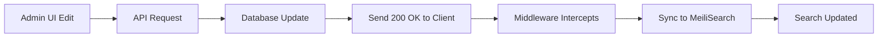

# 🔍 MeiliSearch Auto-Sync Complete Guide

**Last Updated:** February 6, 2026

This document covers the complete MeiliSearch synchronization system, including automatic incremental updates via middleware and manual sync buttons.

---

## 📋 Table of Contents

1. [System Overview](#system-overview)
2. [Auto-Sync via Middleware (Incremental)](#auto-sync-via-middleware-incremental)
3. [Manual Sync Buttons](#manual-sync-buttons)
4. [Sync Logs Reference](#sync-logs-reference)
5. [Troubleshooting](#troubleshooting)
6. [Performance](#performance)

---

## System Overview

### Two Sync Mechanisms

| Method | Trigger | Type | Speed | Use Case |
|--------|---------|------|-------|----------|
| **Middleware Auto-Sync** | Every API edit | Incremental (1 item) | ~50ms | Real-time updates |
| **Manual Sync Button** | User clicks button | Full index (all items) | 2-5s | After DB scripts/migrations |

### What Gets Synced

- **Products**: Title, description, SKU, price, status, categories, images
- **Inventory**: SKU, stock levels, prices, variant info
- **Customers**: Name, email, groups, metadata

---

## Auto-Sync via Middleware (Incremental)

### How It Works

Every time you edit a product, customer, or inventory item through the **Admin UI** or **API**:

1. **Request completes** → Client receives 200 OK
2. **Middleware intercepts** → Detects entity type (product/customer/inventory)
3. **Incremental sync** → Updates **only that specific item** in MeiliSearch
4. **Non-blocking** → Happens **after** response is sent



### Code Location

**File:** `src/api/middlewares.ts`

```typescript
// Middleware that intercepts successful API responses
router.use("*", async (req, res, next) => {
    const originalSend = res.send
    res.send = function(data) {
        if (res.statusCode >= 200 && res.statusCode < 300) {
            // ✅ Incremental sync happens here
            handleAutoSync(req, data)
        }
        return originalSend.call(this, data)
    }
    next()
})
```

### Smart Detection

The middleware automatically detects:
- **Product edits**: `/admin/products/:id` → Syncs 1 product
- **Customer edits**: `/admin/customers/:id` → Syncs 1 customer
- **Inventory edits**: `/admin/products/:id/variants` → Syncs affected inventory items

### What Triggers Auto-Sync

✅ **Automatic sync happens for:**
- Editing product title/description via Admin UI
- Updating product price
- Changing inventory stock levels
- Updating customer information
- Publishing/unpublishing products

❌ **Does NOT trigger for:**
- Direct database queries (use manual sync button)
- SQL scripts/migrations (use manual sync button)
- Bulk updates via admin scripts (use manual sync button)

---

## Manual Sync Buttons

### Where They Are

1. **Products-Advanced** (`/app/products-advanced`)
   - Button: "Check Product Sync"
   - Syncs: All products

2. **Inventory-Advanced** (`/app/inventory-advanced`)
   - Button: "Check Inventory Sync"
   - Syncs: All inventory items

3. **Customers-Advanced** (`/app/customers-advanced`)
   - Button: "Check Customer Sync"
   - Syncs: All customers

### How They Work

#### Smart Sync Detection

When you click a sync button:

1. **Check MeiliSearch stats**:
   - Document count
   - Latest `updated_at` timestamp

2. **Check database stats**:
   - Valid item count
   - Latest `updated_at` timestamp

3. **Compare**:
   ```typescript
   const needsSync = 
       dbCount !== meiliCount ||  // Count mismatch
       dbLastUpdate > meiliLastUpdate + 5000  // DB is >5s newer
   ```

4. **Sync decision**:
   - ✅ **Already synced** → Shows "Synced Already" (no action)
   - 🔄 **Needs sync** → Triggers full sync workflow

#### Backend Implementation

**Endpoint:** `POST /admin/search/{entity}/sync`

```typescript
// Example for inventory
export const POST = async (req, res) => {
    // 1. Get MeiliSearch stats
    const meiliCount = await index.getStats().numberOfDocuments
    const meiliLastUpdate = await getLatestTimestamp()
    
    // 2. Get database stats
    const dbCount = await query.graph({ entity: "inventory_item" })
    const dbLastUpdate = findLatestUpdate(dbCount)
    
    // 3. Smart sync decision
    if (meiliCount === dbCount && timeDiff < 5000) {
        return res.json({ status: "already_synced" })
    }
    
    // 4. Run full sync workflow
    await syncInventoryWorkflow.run()
    return res.json({ status: "synced", count: dbCount })
}
```

### When to Use Manual Sync

Use the sync button when:

✅ After running database cleanup scripts
✅ After migrations that modify prices/inventory
✅ After bulk imports from QuickBooks/external systems
✅ When search results seem stale
✅ After server restart (first time check)

---

## Sync Logs Reference

### Incremental Sync (Middleware)

#### Successful Product Update
```
[MEILI-PRODUCT-SYNC] 🔄 Product prod_01JKH... changed, incremental update
[MEILI-PRODUCT-SYNC] ✅ Updated: UL FREECUT COB LED Strip
```

#### Successful Customer Update
```
[MEILI-CUSTOMER-SYNC] 🔄 Customer cus_01JKH..., incremental update
[MEILI-CUSTOMER-SYNC] ✅ Updated: customer@example.com
```

#### Successful Inventory Update
```
[MEILI-INVENTORY-SYNC] 🔄 Inventory change, incremental update
[MEILI-INVENTORY-SYNC] ✅ Updated 3 items
```

### Manual Full Sync (Button)

#### Already Synced (No Action)
```
🔍 [Inventory Sync Check] DB Valid: 344 | Meili: 344
🔍 [Inventory Sync Status] Count Match: true, Time Sync: true
✅ [Inventory Sync] Already in sync!
```

#### Needs Sync (Full Sync Triggered)
```
🔍 [Inventory Sync Check] DB Valid: 344 | Meili: 0
🔍 [Inventory Sync Status] Count Match: false
🔄 [Inventory Sync] Starting full sync...
✅ [Inventory Sync] Synced 344 items
```

### Error Logs

#### MeiliSearch Connection Error
```
[MEILI-PRODUCT-SYNC] ⚠️  Update failed: ECONNREFUSED
[MEILI-PRODUCT-SYNC] ❌ Error: Connection to MeiliSearch failed
```

#### Document Not Found (Orphaned Data)
```
[MEILI-INVENTORY-SYNC] ⚠️  Inventory item not found: iitem_01...
[MEILI-INVENTORY-SYNC] 🔄 Triggering cleanup sync
```

---

## Troubleshooting

### Problem: Prices Not Showing in Inventory-Advanced

**Symptoms:**
- Database has correct price ($45.25)
- Inventory-Advanced shows old price ($34.99)
- Admin UI variant detail shows correct price

**Root Cause:** MeiliSearch index not synced after direct database changes

**Solution:**
1. Click **"Check Inventory Sync"** button
2. Wait 2-5 seconds for full sync
3. Hard refresh browser (Ctrl+Shift+R)
4. Verify price updated

### Problem: Sync Button Says "Already Synced" But Data is Wrong

**Symptoms:**
- Button shows green checkmark "Synced Already"
- Search results still show old data

**Root Cause:** React Query cache on frontend

**Solution:**
```typescript
// Frontend cache was fixed in inventory-advanced
queryKey: ["custom-inventory-with-prices", Date.now()]  // Forces fresh data
staleTime: 0,  // No caching
gcTime: 0      // No garbage collection cache
```

**Quick Fix:** Hard refresh browser (Ctrl+Shift+R)

### Problem: Sync Button Doesn't Refresh UI

**Root Cause:** Mismatched React Query keys

**Example (WRONG - Before Fix):**
```typescript
// Hook uses this key:
queryKey: ["custom-inventory-with-prices"]

// Button invalidates this key (WRONG!):
onSyncComplete={() => queryClient.invalidateQueries({ 
    queryKey: ["meili-inventory"]  // ❌ Different key
})}
```

**Solution (CORRECT - After Fix):**
```typescript
// Both use the same key:
queryKey: ["custom-inventory-with-prices"]

onSyncComplete={() => queryClient.invalidateQueries({ 
    queryKey: ["custom-inventory-with-prices"]  // ✅ Same key
})}
```

**Status:**
- ✅ **Products-Advanced**: Always worked correctly
- ✅ **Customers-Advanced**: Always worked correctly
- ✅ **Inventory-Advanced**: **Fixed on Feb 4, 2026**

### Problem: Auto-Sync Not Working After Server Restart

**Symptoms:**
- Middleware doesn't intercept requests
- No sync logs appear

**Cause:** Server needs warm-up request

**Solution:**
1. Make **any edit** in Admin UI (change product title, save)
2. Middleware activates
3. Future edits sync automatically

---

## Performance

### Incremental Sync (Middleware)

| Entity | Avg Time | Blocks UI? |
|--------|----------|------------|
| 1 Product | ~50ms | ❌ No |
| 1 Customer | ~30ms | ❌ No |
| 1 Inventory Item | ~40ms | ❌ No |

**Key Point:** Sync happens **after** client receives response, so it never blocks the UI.

### Full Sync (Manual Button)

| Index | Item Count | Time | Blocks UI? |
|-------|------------|------|------------|
| Products | 200+ | 2-3s | ✅ Yes (button shows loading) |
| Inventory | 344 | 3-5s | ✅ Yes |
| Customers | 7,300+ | 8-12s | ✅ Yes |

### Optimization Tips

1. **Use incremental sync** whenever possible (normal edits)
2. **Batch database changes** then sync once
3. **Run manual sync off-hours** for large datasets (>5000 items)
4. **Monitor MeiliSearch resources** on Railway

---

## Advanced: Smart Sync Logic

### Count + Timestamp Verification

The sync button uses **two checks** to avoid unnecessary syncs:

```typescript
const isCountSync = dbCount === meiliCount
const timeDiff = dbLastUpdate.getTime() - meiliLastUpdate.getTime()
const isTimeSync = timeDiff <= 5000  // 5s tolerance

if (isCountSync && isTimeSync) {
    return "already_synced"  // ✅ No sync needed
}
```

**Why 5 seconds tolerance?**
- MeiliSearch indexing is async
- Network latency between Railway services
- Prevents false positives from clock skew

### Orphan Detection

The sync workflow filters out orphaned data:

```typescript
// Only sync items with valid links
const validItems = inventoryItems.filter(item => 
    item.variantId && item.productId
)

console.log(`Valid: ${validItems.length} (${total - validItems.length} orphaned)`)
```

**Example:**
```
🔍 [Inventory Sync Check] DB Valid: 344 (346 total, 2 orphaned)
```

This prevents indexing broken/deleted variants.

---

## Troubleshooting Common Issues

### Price Changes Not Syncing ✅ FIXED Feb 2026

**Problem:** Edited prices in Admin UI don't update in MeiliSearch inventory-advanced.

**Root Cause:** Price changes use `/admin/products/{id}/variants/batch` endpoint which returns `{updated: [...]}` array, not single `variant` object. Middleware wasn't detecting this format.

**Fix Applied:**
1. Added `hasBatchUpdate` detection in middleware condition
2. Aligned incremental workflow fields with full sync (use direct `stocked_quantity` not `location_levels`)
3. Added batch variant ID extraction logic

**Verify Fix:**
```bash
# After changing a price, logs should show:
[MEILI-INVENTORY-SYNC] 📦 Batch update detected: 1 variants
[MEILI-INVENTORY-SYNC] ✅ Updated 1 items for variant xxx
```

See `INVENTORY-ADVANCED-ARCHITECTURE.md` for detailed technical explanation.

---

### Sync Button Shows "Already Synced" But Data is Stale

**Cause:** Timestamp was updated but actual data fields weren't synced (related to batch variant bug above).

**Solution:** After applying the batch variant fix, force a full sync:
1. Run: `yarn exec tsx src/scripts/force/force-rebuild-inventory-index.ts`
2. Click "Check Inventory Sync" button - will detect empty index and rebuild
3. All data should now be correct

---

### Changes Not Appearing After Auto-Sync

**Checklist:**
- [ ] Check server logs for `[MEILI-INVENTORY-SYNC]` messages
- [ ] Verify middleware triggered (should see `🔍 DEBUG` or `📦 Batch` logs)
- [ ] Hard refresh browser (Ctrl+Shift+R) to clear React Query cache
- [ ] Test with manual sync button to rule out middleware issues

---

### For Normal Operations ✅

- [ ] Make changes via Admin UI or API
- [ ] Auto-sync handles everything automatically
- [ ] No manual intervention needed

### After Database Scripts ⚠️

- [ ] Run your migration/cleanup script
- [ ] Open relevant `-advanced` page
- [ ] Click sync button (Check X Sync)
- [ ] Wait for "Synced" confirmation
- [ ] Hard refresh browser if needed

### Troubleshooting 🔧

- [ ] Check server logs for sync errors
- [ ] Verify MeiliSearch is running (Railway)
- [ ] Test with manual sync button
- [ ] Hard refresh browser to clear cache
- [ ] Check React Query key matches in code

---

**Need Help?**

Check the middleware implementation in:
- `src/api/middlewares.ts` (auto-sync logic)
- `src/api/admin/search/{entity}/sync/route.ts` (manual sync endpoints)
- `src/workflows/sync-{entity}.ts` (sync workflows)
