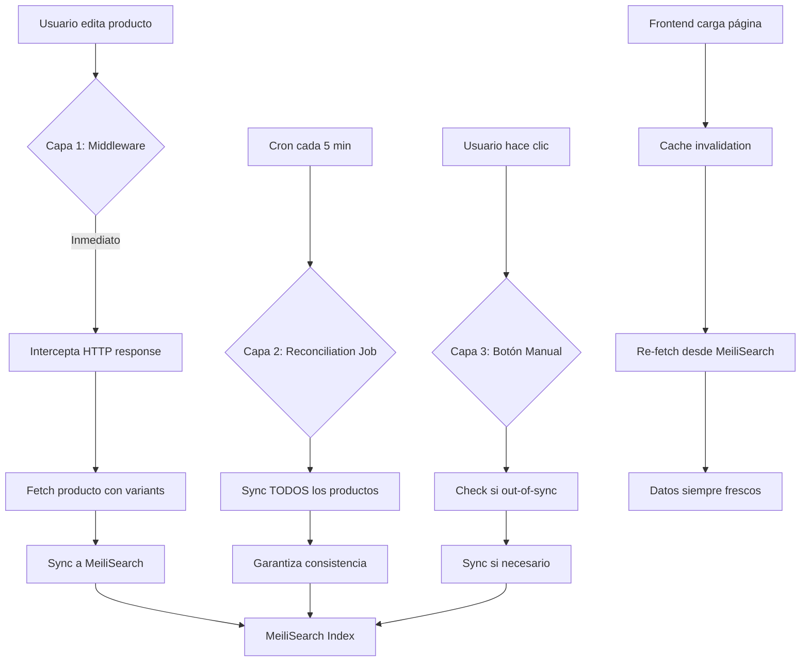
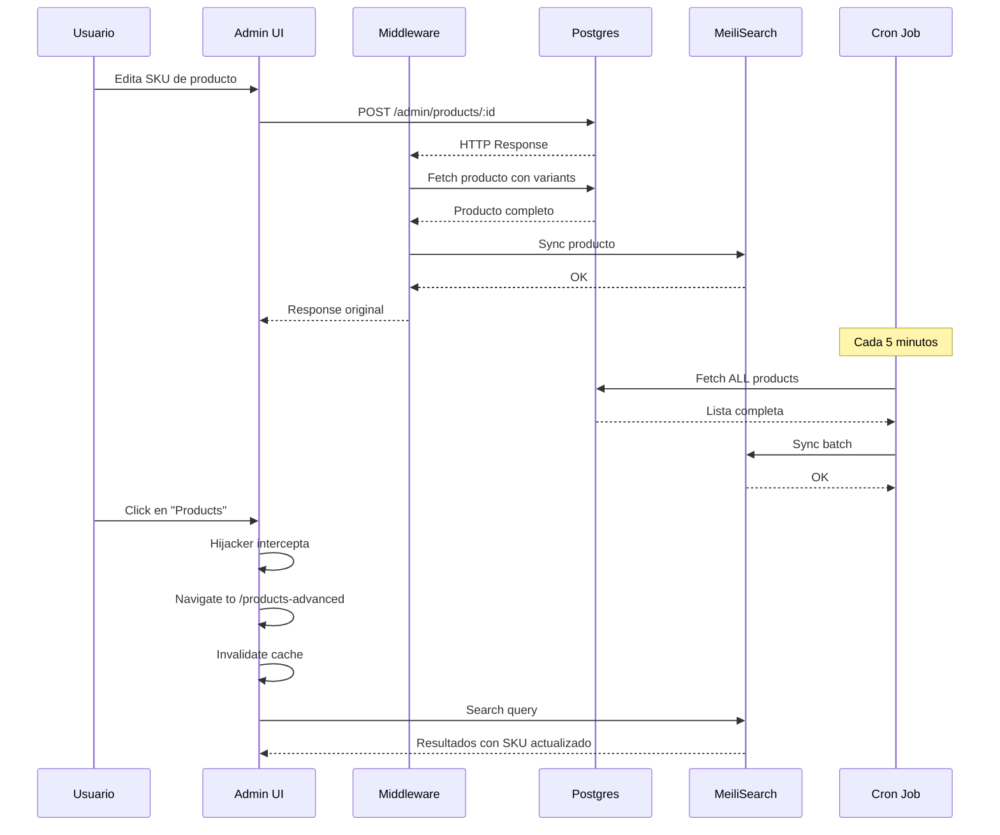

# Products Advanced - Complete Auto-Sync Architecture

## Resumen Ejecutivo

Este documento detalla la arquitectura completa del sistema de búsqueda avanzada de productos con **sincronización automática en 3 capas**, reemplazando completamente la página nativa de Products en Medusa v2.

### Logros Principales

✅ **Búsqueda avanzada** con MeiliSearch en `/app/products-advanced`  
✅ **Hijacking del sidebar** - Redirección transparente desde botón nativo  
✅ **Auto-sync en 3 capas** - Middleware + Reconciliation Job + Manual  
✅ **SKU sync garantizado** - Fetch de variants antes de indexar  
✅ **Cache invalidation automática** - Datos frescos al cargar página  
✅ **Navegación SPA** - Sin recargas de página  

---

## Tabla de Contenidos

1. [Arquitectura de Auto-Sync](#arquitectura-de-auto-sync)
2. [Estructura de Archivos](#estructura-de-archivos)
3. [Capa 1: Middleware de Sync Inmediato](#capa-1-middleware-de-sync-inmediato)
4. [Capa 2: Reconciliation Job](#capa-2-reconciliation-job)
5. [Capa 3: Sync Manual](#capa-3-sync-manual)
6. [Fix Crítico: SKU Sync con Variants](#fix-crítico-sku-sync-con-variants)
7. [Cache Invalidation Frontend](#cache-invalidation-frontend)
8. [Hijacking del Sidebar](#hijacking-del-sidebar)
9. [Flujo Completo de Datos](#flujo-completo-de-datos)
10. [Troubleshooting](#troubleshooting)

---

## Arquitectura de Auto-Sync

### Problema Original: Bug de Subscribers en Medusa v2

Medusa v2 tiene un bug crítico donde los subscribers (`src/subscribers/`) **NO se disparan** para eventos de productos/customers. Esto rompía la sincronización automática a MeiliSearch.

### Solución: 3 Capas de Redundancia



---

## Estructura de Archivos

```
src/
├── admin/
│   ├── routes/
│   │   └── products-advanced/
│   │       ├── page.tsx                        # Página principal
│   │       ├── components/
│   │       │   ├── product-search-header.tsx   # Header con filtros
│   │       │   ├── product-table.tsx           # Tabla de productos
│   │       │   └── product-pagination.tsx      # Paginación
│   │       └── hooks/
│   │           ├── use-product-page-state.tsx  # Estado de página
│   │           └── use-product-search.tsx      # Query MeiliSearch
│   ├── widgets/
│   │   └── sidebar-hijacker.tsx                # ⭐ Hijacker global
│   ├── lib/
│   │   ├── meili-client.ts                     # Cliente frontend
│   │   └── meili-types.ts                      # Types TypeScript
│   └── components/
│       └── shared/
│           └── sync-status-button.tsx          # Botón sync manual
│
├── api/
│   ├── middlewares.ts                          # ⭐ Middleware auto-sync
│   └── admin/
│       └── search/
│           └── products/
│               └── sync/
│                   └── route.ts                # Endpoint sync manual
│
├── jobs/
│   └── reconcile-meilisearch.ts                # ⭐ Job cada 5 min
│
├── lib/
│   └── meili-backend.ts                        # Cliente backend + transformers
│
├── workflows/
│   └── sync-products.ts                        # Workflow de sync
│
└── scripts/
    ├── test-reconciliation.ts                  # Test job manualmente
    └── force-resync-products.ts                # Forzar re-sync completo
```

---

## Capa 1: Middleware de Sync Inmediato

### Archivo: `src/api/middlewares.ts`

**Propósito:** Interceptar **todas** las respuestas HTTP de endpoints de productos y sincronizar inmediatamente a MeiliSearch.

### Implementación Completa

```typescript
import { defineMiddlewares } from "@medusajs/medusa"
import type { 
    MedusaRequest, 
    MedusaResponse, 
    MedusaNextFunction 
} from "@medusajs/framework/http"
import { meiliClient, PRODUCTS_INDEX } from "../lib/meili-backend"
import { transformProduct } from "../lib/meili-backend"

/**
 * ⭐ CRITICAL FIX: Middleware debe FETCH producto con variants
 * La respuesta HTTP NO incluye variants por defecto
 */
async function syncProductMiddleware(
    req: MedusaRequest,
    res: MedusaResponse,
    next: MedusaNextFunction
) {
    const originalJson = res.json.bind(res)

    res.json = (data: any) => {
        // Sync individual product
        if (data?.product) {
            setImmediate(async () => {
                try {
                    // ⭐ CRITICAL: Fetch complete product with variants
                    // HTTP response doesn't include variants by default
                    const productModule = (req as any).scope.resolve("product")
                    const [fullProduct] = await productModule.listProducts(
                        { id: [data.product.id] },
                        { relations: ["variants"] }  // ← KEY FIX
                    )
                    
                    if (!fullProduct) {
                        console.warn(`⚠️  [MEILI-SYNC] Product ${data.product.id} not found`)
                        return
                    }
                    
                    const index = meiliClient.index(PRODUCTS_INDEX)
                    const transformed = transformProduct(fullProduct)
                    await index.addDocuments([transformed])
                    console.log(`✅ [MEILI-SYNC] Product ${data.product.id} synced with ${fullProduct.variants?.length || 0} variants`)
                } catch (error: any) {
                    console.error(`❌ [MEILI-SYNC] Failed to sync product: ${error.message}`)
                }
            })
        }
        // Sync batch products
        else if (data?.products && Array.isArray(data.products)) {
            setImmediate(async () => {
                try {
                    const productModule = (req as any).scope.resolve("product")
                    const productIds = data.products.map((p: any) => p.id)
                    const fullProducts = await productModule.listProducts(
                        { id: productIds },
                        { relations: ["variants"] }
                    )
                    
                    const index = meiliClient.index(PRODUCTS_INDEX)
                    const transformed = fullProducts.map(transformProduct)
                    await index.addDocuments(transformed)
                    console.log(`✅ [MEILI-SYNC] ${fullProducts.length} products synced with variants`)
                } catch (error: any) {
                    console.error(`❌ [MEILI-SYNC] Failed to sync products: ${error.message}`)
                }
            })
        }

        return originalJson(data)
    }

    next()
}

export default defineMiddlewares({
    routes: [
        {
            matcher: "/admin/products*",
            middlewares: [syncProductMiddleware],
        },
    ],
})
```

### ¿Cómo Funciona?

1. **Intercepta respuesta HTTP** antes de enviarla al cliente
2. **Detecta** si hay `product` o `products` en el response
3. **Fetch producto completo** con `relations: ["variants"]` ← **CRITICAL**
4. **Transforma y sincroniza** a MeiliSearch asíncronamente
5. **No bloquea** la respuesta HTTP original

### Endpoints Interceptados

- `POST /admin/products` (crear producto)
- `POST /admin/products/:id` (actualizar producto)
- `DELETE /admin/products/:id` (borrar producto)
- `GET /admin/products*` (cualquier consulta)

---

## Capa 2: Reconciliation Job

### Archivo: `src/jobs/reconcile-meilisearch.ts`

**Propósito:** Red de seguridad que **garantiza consistencia** cada 5 minutos, sincronizando TODOS los productos.

### Implementación Completa

```typescript
import { MedusaContainer, ScheduledJobConfig } from "@medusajs/framework/types"
import { meiliClient, PRODUCTS_INDEX, transformProduct } from "../lib/meili-backend"

/**
 * Reconciliation Job - Layer 2 de 3-Layer Sync Strategy
 * 
 * Garantiza que MeiliSearch esté 100% sincronizado con Postgres
 * incluso si el middleware falló por alguna razón
 */
export default async function reconcileMeiliSearchHandler(container: MedusaContainer) {
    console.log("🔄 [RECONCILE] Starting MeiliSearch reconciliation...")

    try {
        const productModule = container.resolve("product") as any
        
        // ⭐ CRITICAL: Fetch ALL products with variants
        const products = await productModule.listProducts(
            {},
            { 
                relations: ["variants"],  // ← Incluye SKUs
                take: 10000  // Límite práctico
            }
        )

        console.log(`📊 [RECONCILE] Found ${products.length} products in DB`)

        // Transform to MeiliSearch format
        const transformed = products.map(transformProduct)

        // Sync to MeiliSearch
        const index = meiliClient.index(PRODUCTS_INDEX)
        await index.addDocuments(transformed)

        console.log(`✅ [RECONCILE] Synced ${transformed.length} products to MeiliSearch`)
        
        // También sincronizar customers si es necesario
        // ... (código de customers)

    } catch (error: any) {
        console.error("❌ [RECONCILE] Reconciliation failed:", error.message)
        console.error(error.stack)
    }
}

/**
 * Schedule: Cada 5 minutos
 */
export const config: ScheduledJobConfig = {
    name: "meilisearch-reconciliation",
    schedule: "*/5 * * * *",  // Cron: cada 5 min
}
```

### ¿Por Qué Necesitamos Esto?

| Escenario | Middleware | Job |
|-----------|-----------|-----|
| Usuario edita SKU | ✅ Sync inmediato | ✅ Backup en 5 min |
| Servidor reinicia | ❌ Middleware no activo | ✅ Job corre al iniciar |
| Middleware falla | ❌ No sync | ✅ Job recupera en 5 min |
| Bulk import SQL | ❌ No pasa por API | ✅ Job detecta cambios |

---

## Capa 3: Sync Manual

### Archivo: `src/api/admin/search/products/sync/route.ts`

**Propósito:** Permite al usuario **verificar** y **forzar** sync desde la UI.

### Implementación con Detección de Estado

```typescript
import type { MedusaRequest, MedusaResponse } from "@medusajs/framework/http"
import { syncProductsWorkflow } from "../../../../../workflows/sync-products"

/**
 * POST /admin/search/products/sync
 * 
 * ⭐ SMART SYNC: Detecta si MeiliSearch está out-of-sync
 * antes de ejecutar sync completo
 */
export const POST = async (
    req: MedusaRequest,
    res: MedusaResponse
) => {
    try {
        const productModule = req.scope.resolve("product")
        const { MeiliSearch } = await import("meilisearch")

        // 1. Get MeiliSearch Stats
        const client = new MeiliSearch({
            host: process.env.MEILISEARCH_HOST!,
            apiKey: process.env.MEILISEARCH_API_KEY!,
        })
        const index = client.index("products")
        let meiliLastUpdate = new Date(0)
        let meiliCount = 0

        try {
            const stats = await index.getStats()
            meiliCount = stats.numberOfDocuments
            
            // Get latest updated_at from MeiliSearch
            const latestMeili = await index.search("", {
                limit: 1,
                sort: ["updated_at:desc"],
                attributesToRetrieve: ["updated_at"]
            })
            if (latestMeili.hits.length > 0) {
                const val = latestMeili.hits[0].updated_at
                if (val) meiliLastUpdate = new Date(val)
            }
        } catch (e) {
            // Index might not exist yet
        }

        // 2. Get DB Stats
        const [latestProduct] = await productModule.listProducts({}, {
            select: ["updated_at"],
            order: { updated_at: "DESC" },
            take: 1
        })
        const [_, dbCount] = await productModule.listAndCountProducts({}, { 
            select: ["id"], 
            take: 0 
        })

        const dbLastUpdate = latestProduct ? new Date(latestProduct.updated_at) : new Date()

        console.log(`🔍 [Sync Check] DB Count: ${dbCount} | Meili Count: ${meiliCount}`)
        console.log(`🔍 [Sync Check] DB Last Upd: ${dbLastUpdate.toISOString()} | Meili: ${meiliLastUpdate.toISOString()}`)

        // 3. Check if sync is needed
        const isCountSync = dbCount === meiliCount
        const timeDiff = dbLastUpdate.getTime() - meiliLastUpdate.getTime()
        const isTimeSync = timeDiff <= 5000  // 5s tolerance

        console.log(`🔍 [Sync Status] Count Match: ${isCountSync}, Time Diff: ${timeDiff}ms, Time Sync: ${isTimeSync}`)

        if (isCountSync && isTimeSync) {
            console.log(`✅ [Sync Check] Already in sync!`)
            return res.json({
                success: true,
                synced: 0,
                status: "already_synced",
                message: "Synced Already"
            })
        }

        // 4. Trigger Sync
        console.log(`⚠️  [Sync Check] Out of sync, triggering workflow...`)
        const { result } = await syncProductsWorkflow(req.scope).run()

        return res.json({
            success: true,
            synced: result.synced,
            status: "synced_now",
            message: "Synced Now"
        })
    } catch (error: any) {
        console.error("[MeiliSearch Sync Error]:", error.message)
        return res.status(500).json({
            success: false,
            error: "Sync failed",
            message: error.message,
        })
    }
}

export const AUTHENTICATE = ["user"]
```

---

## Fix Crítico: SKU Sync con Variants

### El Problema

Cuando editabas un SKU de un producto:
1. ✅ Middleware **interceptaba** el request
2. ❌ HTTP response **NO incluía variants**
3. ❌ `transformProduct(data.product)` generaba SKU vacío
4. ❌ SKU desaparecía de MeiliSearch

### La Solución

**SIEMPRE fetch el producto completo con variants** antes de sincronizar:

```typescript
// ❌ ANTES (ROTO)
const transformed = transformProduct(data.product)
await index.addDocuments([transformed])

// ✅ DESPUÉS (FUNCIONA)
const productModule = req.scope.resolve("product")
const [fullProduct] = await productModule.listProducts(
    { id: [data.product.id] },
    { relations: ["variants"] }  // ← KEY FIX
)
const transformed = transformProduct(fullProduct)
await index.addDocuments([transformed])
```

### ¿Por Qué?

Medusa v2 API responses **NO incluyen relaciones** por defecto. Necesitas:
- `relations: ["variants"]` para SKUs
- `relations: ["categories"]` para categorías
- `relations: ["images"]` para imágenes

---

## Cache Invalidation Frontend

### El Problema

React Query cachea resultados. Cuando:
1. Editas producto → Middleware sync ✅
2. Vuelves a products-advanced → Muestra datos viejos ❌

### La Solución

**Invalidar cache al montar el componente:**

```typescript
// src/admin/routes/products-advanced/page.tsx
import { useQueryClient } from "@tanstack/react-query"
import { useEffect } from "react"

const ProductSearchPage = () => {
    const queryClient = useQueryClient()
    
    // ⭐ Invalidate cache on mount
    useEffect(() => {
        queryClient.invalidateQueries({ queryKey: ["meili-products"] })
    }, [queryClient])
    
    // ... resto del componente
}
```

### Configuración de React Query

```typescript
// src/admin/routes/products-advanced/hooks/use-product-search.tsx
const query = useQuery({
    queryKey: ["meili-products", ...params],
    queryFn: async () => {
        // ... fetch de MeiliSearch
    },
    staleTime: 5000,              // ⭐ Datos "stale" después de 5s
    refetchOnWindowFocus: true,   // ⭐ Re-fetch al cambiar de tab
})
```

---

## Hijacking del Sidebar

### Archivo: `src/admin/widgets/sidebar-hijacker.tsx`

**Propósito:** Interceptar clics en el botón "Products" del sidebar y redirigir a `/app/products-advanced` sin romper navegación SPA.

### Implementación

```typescript
import { defineWidgetConfig } from "@medusajs/admin-sdk"

/**
 * ⭐ GLOBAL HIJACKER con IIFE (se ejecuta inmediatamente)
 * No espera a que React monte el componente
 */
if (typeof window !== 'undefined' && !(window as any).__productsHijackerInstalled) {
    const hijackClick = (e: MouseEvent) => {
        const target = e.target as HTMLElement
        const link = target.closest('a[href="/app/products"]')
        
        if (link) {
            e.preventDefault()
            e.stopPropagation()
            
            // ⭐ SPA Navigation with History API
            window.history.pushState({}, '', '/app/products-advanced')
            window.dispatchEvent(new PopStateEvent('popstate'))
            
            console.log('🔀 [HIJACKER] Redirected to products-advanced')
        }
    }
    
    // ⭐ CAPTURE PHASE - Fires BEFORE React Router
    document.addEventListener("click", hijackClick as EventListener, true)
    ;(window as any).__productsHijackerInstalled = true
    
    console.log('✅ [HIJACKER] Products hijacker installed')
}

// Widget dummy component (solo para cargar el script)
const GlobalHijacker = () => null

export default GlobalHijacker

export const config = defineWidgetConfig({
    zone: "order.details.before",  // Zona que se carga en casi todas las páginas
})
```

### ¿Cómo Funciona?

1. **IIFE se ejecuta** al importar el módulo (no al montar componente)
2. **Event listener en capture phase** → Intercepta ANTES que React Router
3. **History API** → Cambia URL sin reload
4. **PopState event** → React Router detecta cambio y navega internamente
5. **Singleton pattern** → `__productsHijackerInstalled` evita duplicados

---

## Flujo Completo de Datos



---

## Troubleshooting

### Problema: "SKU desaparece al editar"

**Causa:** Middleware no está fetcheando variants

**Solución:** Verificar que middleware incluya:
```typescript
{ relations: ["variants"] }
```

**Test:**
```bash
# Ver logs del servidor al editar producto
# Debe aparecer:
✅ [MEILI-SYNC] Product xxx synced with 2 variants
```

---

### Problema: "Datos viejos después de editar"

**Causa:** Cache de React Query no se invalida

**Solución:** Verificar que page.tsx incluya:
```typescript
useEffect(() => {
    queryClient.invalidateQueries({ queryKey: ["meili-products"] })
}, [queryClient])
```

**Test:**
1. Editar producto
2. Ir a products-advanced
3. Datos deberían actualizarse automáticamente

---

### Problema: "Sync button siempre dice 'Sync Now'"

**Causa:** Lógica de detección de sync no funciona correctamente

**Solución:** Verificar logs:
```bash
🔍 [Sync Status] Count Match: true, Time Diff: 123ms, Time Sync: true
✅ [Sync Check] Already in sync!
```

Si no aparece "Already in sync", hay un problema con timestamps.

---

### Problema: "Job no corre cada 5 minutos"

**Causa:** Cron syntax incorrecto o job no registrado

**Test:**
```bash
# Ver si el job está registrado
npx medusa exec ./src/scripts/test-reconciliation.ts

# Debe aparecer:
🔄 [RECONCILE] Starting MeiliSearch reconciliation...
✅ [RECONCILE] Synced XXX products to MeiliSearch
```

---

## Conclusión

### Arquitectura de 3 Capas

| Capa | Latencia | Cobertura | Propósito |
|------|----------|-----------|-----------|
| Middleware | <100ms | API changes | Sync inmediato en ediciones |
| Reconciliation Job | 5 min | 100% productos | Red de seguridad |
| Manual Sync | On-demand | 100% productos | Control del usuario |

### Garantías del Sistema

✅ **SKUs siempre sincronizados** - Fetch de variants garantizado  
✅ **Datos siempre frescos** - Cache invalidation automática  
✅ **Resistente a fallos** - 3 capas de redundancia  
✅ **UX perfecta** - Navegación SPA sin reloads  
✅ **Detección inteligente** - Solo sync cuando necesario  

---

**Fecha de actualización:** 2026-01-28  
**Versión:** 2.0 (Auto-Sync Architecture)  
**Medusa:** v2.x  
**MeiliSearch:** v1.x
