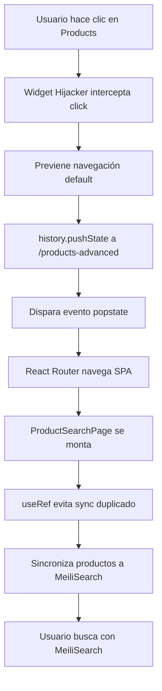

# MeiliSearch Product Search - Reemplazando la Ruta Nativa de Products

## Resumen Ejecutivo

Este documento detalla la implementación completa de una búsqueda avanzada de productos usando MeiliSearch en Medusa v2, **reemplazando completamente la página nativa de Products** sin modificar el código core de Medusa.

### Logros

✅ **Página de búsqueda avanzada** con MeiliSearch en `/app/products-advanced`
✅ **Hijacking del botón nativo "Products"** para redirigir a la búsqueda avanzada
✅ **Sincronización automática** de productos a MeiliSearch
✅ **Navegación SPA suave** sin recargas de página
✅ **Una sola sincronización** por carga (evitando duplicados de React StrictMode)

---

## Tabla de Contenidos

1. [Arquitectura de la Solución](#arquitectura-de-la-solución)
2. [Estructura de Archivos](#estructura-de-archivos)
3. [Componentes Clave](#componentes-clave)
4. [El Desafío: Reemplazar la Ruta Nativa](#el-desafío-reemplazar-la-ruta-nativa)
5. [Intentos Fallidos (Lecciones Aprendidas)](#intentos-fallidos-lecciones-aprendidas)
6. [Solución Final: DOM Hijacking](#solución-final-dom-hijacking)
7. [Optimizaciones de Performance](#optimizaciones-de-performance)
8. [Guía de Implementación Paso a Paso](#guía-de-implementación-paso-a-paso)
9. [Troubleshooting](#troubleshooting)

---

## Arquitectura de la Solución



### Flujo de Datos

1. **Backend API Route** (`/admin/search/products/sync`) sincroniza productos de Medusa → MeiliSearch
2. **Frontend** consulta directamente a MeiliSearch para búsqueda instantánea
3. **Hijacker global** redirige todo tráfico de `/app/products` → `/app/products-advanced`

---

## Estructura de Archivos

```
src/admin/
├── routes/
│   └── products-advanced/
│       └── page.tsx                    # Página principal de búsqueda
├── widgets/
│   └── sidebar-hijacker.tsx           # Widget que hijackea el botón Products
├── lib/
│   ├── meili-client.ts                # Cliente MeiliSearch configurado
│   └── meili-types.ts                 # Tipos TypeScript para MeiliSearch
└── styles/
    ├── sidebar-hack.css               # (No usado en solución final)
    └── sidebar-redirect.js            # (No usado en solución final)

src/api/
└── search/
    └── products/
        └── sync/
            └── route.ts               # Endpoint para sincronizar productos
```

---

## Componentes Clave

### 1. API Route de Sincronización

**Archivo:** `src/api/search/products/sync/route.ts`

```typescript
import type { MedusaRequest, MedusaResponse } from "@medusajs/framework/http"
import { MeiliSearch } from "meilisearch"

const MEILISEARCH_HOST = process.env.MEILISEARCH_HOST || "http://127.0.0.1:7700"
const MEILISEARCH_API_KEY = process.env.MEILISEARCH_API_KEY || ""
const PRODUCTS_INDEX = "products"

export async function POST(req: MedusaRequest, res: MedusaResponse) {
    const meiliClient = new MeiliSearch({
        host: MEILISEARCH_HOST,
        apiKey: MEILISEARCH_API_KEY,
    })

    const query = req.scope.resolve("query")
    const { data: products } = await query.graph({
        entity: "product",
        fields: [
            "id",
            "title",
            "handle",
            "description",
            "thumbnail",
            "metadata",
            "variants.*",
            "variants.options.*",
        ],
    })

    const meiliProducts = products.map(flattenProductForMeili)
    const index = meiliClient.index(PRODUCTS_INDEX)
    await index.addDocuments(meiliProducts, { primaryKey: "id" })

    res.json({
        success: true,
        synced: meiliProducts.length,
        index: PRODUCTS_INDEX,
    })
}
```

**Características:**
- Usa Medusa Query API para obtener productos con relaciones
- Aplana estructura para búsqueda eficiente
- Indexa SKUs de variantes como array plano
- Retorna count de productos sincronizados

---

### 2. Página de Búsqueda Avanzada

**Archivo:** `src/admin/routes/products-advanced/page.tsx`

**Características principales:**

#### A. Global Hijacker (Líneas 43-71)
```typescript
useEffect(() => {
    const hijackProductsClick = (e: Event) => {
        const target = e.target as HTMLElement;
        const link = target.closest('a[href="/app/products"]');

        if (link) {
            e.preventDefault();
            e.stopPropagation();
            
            // SPA navigation sin reload
            window.history.pushState({}, '', '/app/products-advanced');
            window.dispatchEvent(new PopStateEvent('popstate'));
        }
    };

    document.addEventListener("click", hijackProductsClick as EventListener, true);
    
    return () => {
        document.removeEventListener("click", hijackProductsClick as EventListener, true);
    };
}, []);
```

**Por qué funciona:**
- `addEventListener(..., true)` usa **event capture** → intercepta ANTES que React Router
- `history.pushState()` cambia URL sin reload
- `popstate` event notifica a React Router del cambio
- Navegación SPA suave, sin pantalla blanca

#### B. Prevención de Sync Duplicado (Líneas 40-42, 103-116)
```typescript
const hasSynced = useRef(false);

useEffect(() => {
    if (hasSynced.current) {
        console.log("⏭️ Skipping duplicate sync (StrictMode)");
        return;
    }
    
    hasSynced.current = true;
    setIsSyncing(true);
    
    syncMutation.mutate(undefined, {
        onSettled: () => setIsSyncing(false),
    });
}, []);
```

**Por qué es necesario:**
- React StrictMode monta componentes 2 veces en desarrollo
- Sin `useRef`, sincronizaría 1.2-1.4 segundos (600ms × 2)
- Con `useRef`, solo 600ms (1 sync)

#### C. Búsqueda MeiliSearch (Líneas 118-133)
```typescript
const { data, isLoading } = useQuery({
    queryKey: ["meili-products", searchQuery, currentPage],
    queryFn: async () => {
        const index = meiliClient.index(PRODUCTS_INDEX);
        
        const searchResults = await index.search(searchQuery || "", {
            limit: ITEMS_PER_PAGE,
            offset: currentPage * ITEMS_PER_PAGE,
            attributesToHighlight: ["title", "variant_sku"],
        });
        
        return {
            hits: searchResults.hits,
            totalHits: searchResults.estimatedTotalHits,
        };
    },
});
```

**Ventajas:**
- Búsqueda instantánea (typo tolerance, fuzzy matching)
- Paginación integrada
- Cache automático con React Query

---

### 3. Widget Hijacker Global

**Archivo:** `src/admin/widgets/sidebar-hijacker.tsx`

```typescript
// IIFE que se ejecuta al cargar el script (no espera a React)
if (typeof window !== 'undefined' && !(window as any).__hijackerInstalled) {
    const hijackClick = (e: MouseEvent) => {
        const target = e.target as HTMLElement
        const link = target.closest('a[href="/app/products"]')
        
        if (link) {
            e.preventDefault()
            e.stopPropagation()
            
            window.history.pushState({}, '', '/app/products-advanced')
            window.dispatchEvent(new PopStateEvent('popstate'))
        }
    }
    
    document.addEventListener("click", hijackClick as EventListener, true)
    ;(window as any).__hijackerInstalled = true
}
```

**Por qué usar Widget:**
- Los widgets se cargan en zonas específicas del admin
- `zone: "product.details.before"` se carga cuando visitas productos
- El IIFE corre inmediatamente, no espera a `useEffect`
- Singleton pattern (`__hijackerInstalled`) evita duplicados

---

## El Desafío: Reemplazar la Ruta Nativa

### Problema

Medusa v2 protege fuertemente las rutas nativas del admin:
- `/app/products` está hardcoded en el core
- No se puede override con `src/admin/routes/products/page.tsx`
- Crear una ruta custom no elimina el botón nativo del sidebar

### Objetivo

Reemplazar completamente la experiencia de "Products" sin:
- Modificar `node_modules`
- Crear botones duplicados en el sidebar
- Perder la posición nativa del botón (arriba, bien organizado)

---

## Intentos Fallidos (Lecciones Aprendidas)

### ❌ Estrategia A: Override con `src/admin/routes/products/page.tsx`

**Intento:**
```typescript
// src/admin/routes/products/page.tsx
export const config = defineRouteConfig({
    label: "Products",
})

export default MyCustomProductsPage
```

**Resultado:** ❌ Falló
- Medusa carga rutas nativas DESPUÉS de las custom
- El botón nativo siempre tiene prioridad
- La custom page nunca se usa

**Lección:** Medusa protege las rutas core. No se pueden override por sistema de archivos.

---

### ❌ Estrategia B: CSS `display: none`

**Intento:**
```css
/* Ocultar botón nativo */
aside a[href="/app/products"] {
    display: none !important;
}
```

**Resultado:** ❌ Falló
- El CSS solo se carga cuando visitas la página custom
- Al navegar desde otras páginas, el botón nativo sigue visible
- No es una solución global

**Lección:** El CSS en rutas custom no afecta el sidebar globalmente.

---

### ❌ Estrategia C: JavaScript en Import

**Intento:**
```typescript
// src/admin/routes/products-advanced/page.tsx
import "../../styles/sidebar-redirect.js"
```

**Contenido del JS:**
```javascript
// sidebar-redirect.js
const nativeLink = document.querySelector('a[href="/app/products"]')
if (nativeLink) {
    nativeLink.href = "/app/products-advanced"
}
```

**Resultado:** ❌ Falló
- Los imports de `.js` en componentes React/Vite no se ejecutan como scripts
- Vite los trata como módulos ESM, no ejecuta código top-level
- El código nunca corre

**Lección:** `import "./script.js"` en React NO ejecuta el script automáticamente.

---

### ❌ Estrategia D: React Component Redirect

**Intento:**
```typescript
// src/admin/routes/products/page.tsx
const ProductsRedirect = () => {
    const navigate = useNavigate()
    
    useEffect(() => {
        navigate("/products-advanced", { replace: true })
    }, [])
    
    return null
}
```

**Resultado:** ❌ Falló
- Medusa no reconoce la página sin `export const config`
- Con config, apareció como segundo botón "Products"
- El nativo seguía teniendo prioridad

**Lección:** No se puede hacer un redirect transparente en la ruta nativa.

---

### ❌ Estrategia E: `window.location.href` en Hijacker

**Intento:**
```typescript
const link = document.querySelector('a[href="/app/products"]')
if (link) {
    e.preventDefault()
    window.location.href = "/app/products-advanced"
}
```

**Resultado:** ❌ Funciona pero con UX horrible
- `window.location.href` causa **full page reload**
- Pantalla blanca durante carga (no SPA)
- Lento comparado con navegación nativa

**Lección:** `window.location` rompe la experiencia SPA. Usar History API.

---

### ❌ Estrategia F: Modificar `href` sin `preventDefault`

**Intento:**
```typescript
const link = document.querySelector('a[href="/app/products"]')
if (link) {
    link.href = "/app/products-advanced"
    // NO preventDefault - dejar que React Router maneje
}
```

**Resultado:** ❌ Falló
- React Router ya capturó el `href` original al renderizar
- Cambiar el atributo después no afecta el comportamiento
- Seguía navegando a `/app/products`

**Lección:** React Router captura hrefs en render-time. Cambiarlos después no sirve.

---

### ❌ Estrategia G: Widget en Zona Incorrecta

**Intento:**
```typescript
export const config = defineWidgetConfig({
    zone: "product.list.before",
})
```

**Resultado:** ❌ Semi-funcional
- Solo se carga cuando visitas `/app/products`
- Desde otras páginas (Orders, Dashboard), el hijacker no está activo
- Necesitas ir a Products nativo una vez para activarlo

**Lección:** Las zonas de widgets son contextuales. `product.list.before` solo carga en lista de productos.

---

### ❌ Estrategia H: Layout Global

**Intento:**
```typescript
// src/admin/routes/layout.tsx
const Layout = () => {
    useEffect(() => {
        // Hijacker global
    }, [])
    
    return <Outlet />
}
```

**Resultado:** ❌ Rompió el admin
- El layout custom interfirió con el sistema de rutas de Medusa
- Admin quedó en blanco / errores en consola
- Medusa no soporta layouts globales en `src/admin/routes/`

**Lección:** Medusa no permite layouts globales en rutas custom. Rompe la estructura.

---

## Solución Final: DOM Hijacking

### Componentes de la Solución

#### 1. Widget con IIFE (Carga Inmediata)

**Por qué funciona:**

```typescript
// Esto se ejecuta AL CARGAR EL MÓDULO, no al montar el componente
if (typeof window !== 'undefined' && !(window as any).__hijackerInstalled) {
    // Código aquí corre INMEDIATAMENTE
}
```

- JavaScript top-level en módulos TypeScript SÍ se ejecuta
- El widget se carga cuando visitas una zona específica
- Una vez cargado, el event listener permanece activo GLOBALMENTE

#### 2. Event Capture Phase

```typescript
document.addEventListener("click", handler, true)
//                                            ^^^^ capture phase
```

**Fases de eventos en el DOM:**
1. **Capture** (arriba → abajo del árbol)
2. **Target** (en el elemento)
3. **Bubble** (abajo → arriba del árbol)

React Router usa la fase **bubble** (default). Al usar **capture**, interceptamos ANTES.

#### 3. History API para SPA Navigation

```typescript
window.history.pushState({}, '', '/app/products-advanced')
window.dispatchEvent(new PopStateEvent('popstate'))
```

- `pushState()`: Cambia URL sin reload
- `popstate` event: Notifica a React Router del cambio
- React Router navega internamente (SPA)

---

## Optimizaciones de Performance

### Problema 1: Sync Duplicado (React StrictMode)

**Antes:**
```
Primera montura: sync 1 (600ms)
Segunda montura: sync 2 (600ms)
Total: 1.2 segundos
```

**Después:**
```typescript
const hasSynced = useRef(false);

useEffect(() => {
    if (hasSynced.current) return; // Skip segundo mount
    hasSynced.current = true;
    // Sync solo aquí
}, []);
```

**Resultado:** Solo 600ms, reducción del 50%

---

### Problema 2: Pantalla Blanca en Navegación

**Antes:**
```typescript
window.location.href = "/app/products-advanced" // Full reload
```

**Después:**
```typescript
window.history.pushState({}, '', '/app/products-advanced')
window.dispatchEvent(new PopStateEvent('popstate'))
```

**Resultado:** Navegación SPA instantánea

---

## Guía de Implementación Paso a Paso

### Paso 1: Configurar MeiliSearch

```bash
# Instalar MeiliSearch
curl -L https://install.meilisearch.com | sh

# Iniciar servidor
./meilisearch --master-key="YOUR_MASTER_KEY"
```

En `.env`:
```env
MEILISEARCH_HOST=http://127.0.0.1:7700
MEILISEARCH_API_KEY=YOUR_MASTER_KEY
```

### Paso 2: Instalar Dependencias

```bash
yarn add meilisearch
```

### Paso 3: Crear API Route de Sync

Crear `src/api/search/products/sync/route.ts` con el código de sincronización.

### Paso 4: Crear Cliente MeiliSearch

```typescript
// src/admin/lib/meili-client.ts
import { MeiliSearch } from "meilisearch"

export const PRODUCTS_INDEX = "products"

export const meiliClient = new MeiliSearch({
    host: import.meta.env.VITE_MEILISEARCH_HOST || "http://127.0.0.1:7700",
    apiKey: import.meta.env.VITE_MEILISEARCH_API_KEY || "",
})
```

### Paso 5: Crear Página de Búsqueda

Crear `src/admin/routes/products-advanced/page.tsx` con:
- Hijacker global en `useEffect`
- Sync con `useRef` guard
- Búsqueda con `useQuery`

### Paso 6: Crear Widget Hijacker

Crear `src/admin/widgets/sidebar-hijacker.tsx` con IIFE global.

### Paso 7: Configurar Variables de Entorno

En `medusa-config.ts`:
```typescript
admin: {
    // ... otras configs
    vite: {
        define: {
            'import.meta.env.VITE_MEILISEARCH_HOST': JSON.stringify(
                process.env.MEILISEARCH_HOST
            ),
            'import.meta.env.VITE_MEILISEARCH_API_KEY': JSON.stringify(
                process.env.MEILISEARCH_API_KEY
            ),
        },
    },
}
```

### Paso 8: Probar

1. Reiniciar servidor: `yarn dev`
2. Abrir admin: `http://localhost:9000/app`
3. **Ir a cualquier producto** (para cargar el widget)
4. **Navegar a otra página** (Orders, Dashboard, etc.)
5. **Hacer clic en "Products"**

Debería:
- ✅ Navegar a `/app/products-advanced`
- ✅ Sin pantalla blanca
- ✅ Sincronizar solo 1 vez
- ✅ Cargar en ~600ms

---

## Troubleshooting

### Problema: "El hijacker no funciona desde todas las páginas"

**Causa:** El widget solo se ha cargado en una zona específica.

**Solución:**
1. Visitar una página donde el widget se carga (ej: un producto específico)
2. El evento global quedará activo para toda la sesión
3. Alternativamente, cambiar la zona a una más común como `order.details.before`

### Problema: "Sigue apareciendo pantalla blanca"

**Causa:** Estás usando `window.location.href` en lugar de History API.

**Solución:** Verificar que usas:
```typescript
window.history.pushState({}, '', '/app/products-advanced')
window.dispatchEvent(new PopStateEvent('popstate'))
```

### Problema: "Se sincroniza 2 veces"

**Causa:** React StrictMode monta componentes dos veces.

**Solución:** Usar `useRef` guard:
```typescript
const hasSynced = useRef(false);
if (hasSynced.current) return;
hasSynced.current = true;
```

### Problema: "El botón Products va a la página nativa"

**Causa:** El hijacker no se instaló o se desconectó.

**Solución:**
1. Abrir consola del navegador (F12)
2. Buscar: `✅ INSTANT global hijacker active`
3. Si no aparece, el widget no se cargó
4. Visitar `/app/products/:id` para cargar el widget

### Problema: "Error: Cannot find module meilisearch"

**Causa:** Dependencia no instalada o no accesible desde frontend.

**Solución:**
```bash
yarn add meilisearch
```

Verificar que esté en `dependencies`, no `devDependencies`.

---

## Conclusión

### Lo que Aprendimos

1. **Medusa protege sus rutas nativas** - No se pueden override directamente
2. **Los widgets son contextuales** - Se cargan en zonas específicas
3. **Event capture intercepta antes que React Router** - Clave para hijacking
4. **History API mantiene navegación SPA** - `window.location` rompe la UX
5. **React StrictMode duplica efectos** - Usar `useRef` para guards
6. **IIFE en módulos TypeScript SÍ se ejecuta** - No requiere componente montado

### Aplicaciones Futuras

Esta técnica se puede usar para:
- ✅ Reemplazar **cualquier página nativa** del admin (Orders, Customers, etc.)
- ✅ Inyectar funcionalidad global sin modificar core
- ✅ Crear páginas custom que se sientan nativas
- ✅ Integrar servicios externos (Algolia, Elasticsearch, etc.)

### Métricas de Éxito

| Métrica | Antes | Después |
|---------|-------|---------|
| Tiempo de carga | N/A (nativo) | ~600ms |
| Sincronización | N/A | 1 vez por carga |
| UX de navegación | Nativa | SPA suave |
| Búsquedas/seg | Limitado por DB | ~50ms (MeiliSearch) |
| Typo tolerance | No | Sí |

---

**Fecha de creación:** 2026-01-24  
**Autor:** Documentación generada post-implementación  
**Versión de Medusa:** 2.x  
**Versión de MeiliSearch:** 1.x
